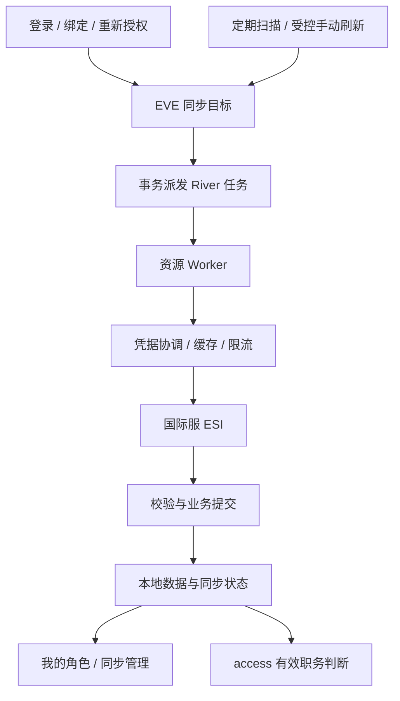

# ESI 同步实施方案

> 接入基线 / 历史调研：本文包含当时建议，不等于全部已实现。当前模块指南见[接入目录](README.md)，当前版本与待办见[项目状态](../project-status.md) / [待办](../backlog.md)。上游核验日期保留原记录。

> 实施更新：第一期现已交付；下文保留方案 v1 的决策背景。实际行为、迁移、差异及限制见 [运行指南](esi-sync.zh-CN.md)。

日期：2026-09-14。版本：方案 v1。状态：**历史方案；首期已实现，当前运行指南优先**。[English](esi-sync-plan.en.md)

依据：[SeAT 源码调研](seat-esi-sync.zh-CN.md)、[项目架构](../architecture.md)、[技术栈](../tech-stack.md)。本文把研究结论收敛为首期范围，具体技术参数仍需实现和测试验证。

## 1. 目标与首期范围

建立统一、可恢复、可扩展的 ESI 后台同步能力，让页面稳定读取本地数据，让权限系统使用有明确有效期的游戏职务事实。

| 首期交付 | 内容 |
| --- | --- |
| 持久化后台任务 | River 开源核心、事务入队、资源去重、延后、重试、崩溃恢复 |
| 角色基础资料 | 已绑定角色的公开名称、军团/联盟等基础字段；不自动绑定或合并账号 |
| 角色授权事实 | 迁移现有归属、四组军团职务、军团名称/CEO/联盟快照；保持 access 的读取契约 |
| 同步状态 | 按角色与资源记录最近检查、最近成功、下次执行及异常 |
| 成员入口 | “我的角色”查看自身同步状态，按条件刷新或重新授权 |
| 管理入口 | 查看全站同步任务状态、筛选异常和重试；不开放原始令牌或私有业务数据 |

资产、钱包、工业、合同、邮件、击杀和报表数据随后按业务模块加入。SDE 按独立版本导入方案实施，不阻塞本期基础身份与职务同步。已有 57 项授权范围不意味着立即采集全部数据。

## 2. 架构与扩展方式

采用 **Go + River + PostgreSQL**，继续使用 pgx、sqlc、Goose。River 表由其配套迁移工具管理，业务表由 Goose 管理；首期 API 与 worker 同进程运行，生命周期和并发预算单独管理。

| 边界 | 职责 |
| --- | --- |
| `internal/platform/jobs`（拟新增） | River 构建、worker 注册、事务派发、启动停止与基础观测；不理解 EVE 业务字段 |
| `internal/modules/eve` | ESI 客户端、凭据协调、资源注册与调度、同步状态、基础角色/授权数据 |
| 后续业务模块 | 声明所需资源，拥有映射、幂等写入和业务查询；通过注入接口调用 EVE 能力 |
| `identity` | 账号与角色绑定的唯一事实来源；同步不能变更角色所属本站账号 |
| `access` | 本站权限判断；读取可信且未过期的职务 DTO |
| `internal/app` | 显式组装启用模块、注册任务、控制启动停止，不在模块构造函数内启动 goroutine |

资源注册信息包含 ID/版本、所属模块、实体类型、所需 scopes、依赖、调度策略和 worker。只注册已编译且启用的资源；未知资源拒绝派发。任务载荷只包含目标 ID、授权代次和业务版本，不包含令牌、QQ/KOOK 或完整响应。

跨模块继续使用窄业务接口和私有 store。本期不把 River 的类型塞进纯模块 Manifest，也不开放在线安装/热卸载插件；宿主另行显式注册模块提供的 worker。具体 Go 签名在实现时确定。

## 3. 首批任务与调度流程

| 任务名（拟） | 实体 | 工作 |
| --- | --- | --- |
| `eve.sync-dispatch.v1` | 全站 | 有界扫描到期目标并派发；不请求 ESI |
| `eve.character-profile.v1` | 角色 | 更新公开基础资料，保存到 eve 所属表 |
| `eve.character-authorization.v1` | 角色 | 协调归属、职务及军团基础信息，形成一致的权限快照 |

授权快照继续作为一个业务任务提交，内部复用公共请求缓存；首期不把这组权限事实拆成互相独立提交的任务。公开资料出现新军团只能提示归属发生变化，不能把旧 Director 职务移植到新军团。军团私有资源正式开发时，再增加以军团为唯一主体的任务和凭据选择机制。

触发规则：

1. 首次授权、绑定和重新授权，在保存凭据的事务内更新同步目标、授权代次并派发所需任务。普通会话登录不重复强制拉取全部资源。
2. 扫描器启动时运行，之后建议每 30 秒扫描一批。数据库的 `next_due_at` 是进度依据；停止期间漏掉的扫描通过下次到期扫描恢复，不重放每个错过的时间点。
3. 派发在短事务中锁定目标，调用 River `InsertTx`，回写活动任务关联；失败一并回滚。目标存在活动任务时复用，不因多次点击增殖任务。
4. River 唯一性覆盖目标及活动状态，明确排除 completed；包含 retryable，避免重试中被重复入队。唯一任务仍可能重复执行，worker 必须幂等。
5. 领取后校验模块、角色绑定、授权代次及资源版本，再获取凭据和数据。成功提交业务数据与状态；故障根据类别延后或终止。
6. 扫描器同时修复终态任务遗留的目标关联。重启后不能因残留“运行中”永久阻塞，也不能把仍有效的运行任务直接重复派发。

River 开源周期调度本身在内存中保存计划，因此这里只用它唤醒扫描器；业务到期时间由我们持久化。[周期任务](https://riverqueue.com/docs/periodic-jobs) 事务派发采用官方接口。[事务入队](https://riverqueue.com/docs/transactional-enqueueing) 唯一性与至少一次执行的边界见[唯一任务](https://riverqueue.com/docs/unique-jobs)。不依赖 Pro 工作流或持久化周期任务。

频率以端点响应为依据。每个请求独立遵守缓存期；多端点任务在最早需要复核的组成部分到期后运行，其余部分可复用有效缓存，不能每次都重置全部数据的新鲜度。缺少可用缓存时间时，首期建议采用 5 分钟保守间隔；首次运行可立即进行，周期同步增加小幅随机偏移。上游要求的等待时间始终是下限。

## 4. 数据与状态模型

以下为逻辑设计，不是已发布迁移；最终列名、约束和索引须随实现审查。

| 表/现有结构 | 设计用途与关键约束 |
| --- | --- |
| `eve_sync_targets`（新增） | 环境、模块、资源、实体类型/ID 唯一；到期时间、活动任务 ID、授权代次、启用状态、执行租约与 fencing 序号 |
| `eve_sync_runs`（新增） | 目标、River job ID、尝试次数、开始/结束、结果、错误类别、HTTP 状态、耗时和计数；不保存敏感原始响应 |
| `eve_esi_cache`（新增） | 规范化请求键、ETag、Expires、Last-Modified、响应体、大小和访问范围；私有缓存加密，按代次隔离 |
| `eve_esi_limits`（新增） | 共享的请求组/调用身份预算、暂缓截止及更新版本；兼容旧错误预算 |
| `eve_character_profiles`（新增） | eve 所有的公开资料及内容/检查时间；不直接修改 identity 的角色归属 |
| `eve_credentials`（扩展） | 保留加密凭据；增加 `grant_generation` 与刷新版本。把凭据可用性逐步从任务调度状态中分离 |
| `eve_role_snapshots`（保留/扩展） | 保留 access 使用的快照；记录相关授权代次和各来源校验时间 |

River 负责队列执行状态；业务表负责数据完整性、新鲜度、上下文和审计。不另建第二套任务重试引擎。活动任务关联不依赖永远保留 River 已完成记录。

任务状态与数据新鲜度分别记录：

| 维度 | 值 | 页面含义 |
| --- | --- | --- |
| 执行状态 | idle / queued / running / deferred / failed / blocked | 空闲、排队、同步中、稍后重试、失败、需要处理 |
| 新鲜度 | never / fresh / stale | 未同步、已更新、数据待更新 |
| 阻塞原因 | reauthorize / missing_scope / missing_role / module_disabled / identity_changed | 由具体原因决定恢复方式，不统一显示“失败” |

`last_attempt_at` 表示已开始尝试；`last_success_at` 表示完整检查成功（包括可验证的 304）；`content_updated_at` 表示已知内容版本时间；`next_due_at` 表示预定下次执行，排队积压可能使实际时间更晚。分组没有完成前不显示整体成功，也不伪造百分比。

执行采用有期限租约和递增 fencing 序号，提交时同时检查目标序号与授权代次。老 worker 在租约失效、解绑或重新授权之后返回的结果不能覆盖新结果。执行时间必须小于租约有效期或续租；无法续租应取消工作。

## 5. 凭据与权限事实一致性

- `grant_generation` 在绑定上下文、重新授权或凭据替换时递增；普通 access token 轮换只改变刷新版本。旧任务执行前及提交前都检查代次和当前绑定关系。
- 刷新凭据时使用数据库角色行锁：等待锁后重新读取凭据，只在仍需刷新时请求 SSO，成功后立即加密提交。锁仅覆盖有超时上限的刷新调用，不覆盖随后整个 ESI 业务采集。
- ESI HTTP 请求与刷新留在 eve 模块内，业务模块不获得 refresh token。刷新成功后的持久化不随后续 ESI 失败回滚。
- 无法把 CCP 的令牌轮换和本地数据库提交做成分布式事务。发生“上游已轮换但本地无法落库”的不确定故障时记录安全错误、停止并发重放，尝试受控恢复；确认旧凭据无效时要求重新授权，不承诺绝对无损恢复。
- 401 先重新读取当前凭据，最多进行一次合理刷新后重试。确认撤权才标记凭据失效；403 根据端点区分缺 scope、职务、归属或其他拒绝，不盲目销毁整枚凭据。
- 检测退团/换团立即使旧军团权限事实无效。等待涉及端点各自旧缓存到期后重新验证，再发布新军团事实；缓存命中不能绕过该保护。
- 保留当前权限有效期检查，改由组成快照的授权相关事实共同决定有效期，不因调度或 304 无条件延长全部旧事实。前端可展示上次数据；access 只消费满足有效期与归属检查的事实。
- 解绑取消后续调度、失效授权代次、删除可用凭据及私有缓存；在途任务的提交检查保证其不能恢复已解绑数据。日志保留必要脱敏记录。

## 6. 请求、缓存、重试与提交

客户端统一负责环境、兼容日期、User-Agent、超时、响应大小限制、错误分类和分页元数据。私有请求键包含角色、授权代次与 scope 上下文；公共请求可以共享，但仍区分方法、路径、规范化参数、请求体、语言和兼容日期。缓存既设单项上限，也设总量及清理策略。

使用 `Expires` 和条件请求，不提供“强制绕过 ESI 缓存”。304 必须有同一上下文的有效本地响应体，缺失时进行不带条件头的受控重新请求；不能将空数据当成功。缓存校验时间与业务落库时间分别处理。

新限流按路由 group 与调用身份共享协调，旧错误预算按有效出口范围协调；限流数据库写入采用原子更新，并为并发在途请求预留预算，不能由迟到响应把预算错误调大。收到 429 按已知作用域延后；缺少分组信息时采用保守端点/身份暂停。420 触发出口范围暂停。不可通过更换身份、IP 或兼容日期绕过限制。[CCP 限流](https://developers.eveonline.com/docs/services/esi/rate-limiting/)

网络/5xx 建议最多 5 次连续尝试，采用有上限的指数退避及随机偏移；耗尽后标记失败、正常高频派发停止，保留每小时一次的恢复探测或管理员受控重试。420/429 是延后，不作为业务失败次数累加。授权或身份阻塞由相应变化解除；确定的解析/契约错误停止自动尝试并记录诊断。初始时间参数为方案值，需验证后配置化。

完整数据及成功状态在业务事务中提交；重复执行同一已提交运行不得再次更新计数或制造事件。遇到部分分页失败不得清空旧快照。未来增加大数据资源时采用分批暂存及完整版本发布；流水类资源按自然唯一键幂等写入，不套用快照删除逻辑。[缓存与分页参考](https://developers.eveonline.com/docs/services/esi/best-practices/)

## 7. 页面与 API 草案

页面继续采用 Corporate Clean 和[通用 UI 规范](../ui-design-rules.md)。本节是页面需求草案，不修改全局风格。ui-ux-pro-max 的异步反馈建议已核对：加载反馈、防重复提交、成功/失败结果；视觉配置以项目规范为准。

**我的角色：**在当前角色详情内合并展示“基础资料”和“ESI 授权”两行同步结果，每行保留状态和最近成功时间，刷新使用统一 `IconAction`。授权需要处理时显示简短原因和“重新授权”。不再添加大面积说明卡片，不把“任务已入队”显示为“同步成功”。

**同步管理（拟 `/sync`）：**一个标题、搜索/状态筛选和任务列表。桌面列为对象（头像＋名称）、数据项、状态、最近成功、下次执行、操作；异常原因及重试记录渐进展开。手机改为紧凑对象行，状态与操作不折叠；不展示队列内部参数来填充页面。首期不做趋势图和逐秒倒计时。

活动任务时建议每 5 秒查询一次状态，空闲时降低频率，隐藏页面暂停轮询。刷新按钮在提交期间禁用并提供反馈；状态变化保留行位置与阅读焦点。桌面、375px、320px、200% 缩放与键盘操作纳入验收。

| API（拟，均未实现） | 权限与行为 |
| --- | --- |
| `GET /api/v1/eve/sync/characters/{id}` | 登录＋`eve.sync.self`＋当前角色归属检查；返回本人的资源状态 |
| `POST /api/v1/eve/sync/characters/{id}/refresh` | 同上＋CSRF；只接受首期资源白名单，不接受 endpoint/凭据/队列参数 |
| `GET /api/v1/eve/sync/targets` | `eve.sync.manage`；服务器分页和筛选，仅任务元数据 |
| `GET /api/v1/eve/sync/targets/{id}/runs` | `eve.sync.manage`；受限运行记录，无原始响应或令牌 |
| `POST /api/v1/eve/sync/targets/{id}/retry` | `eve.sync.manage`＋CSRF；审计操作者、目标和结果，不绕过等待/授权 |

`eve.sync.self` 是成员自助能力，必须额外校验对象归属；不加入可授予全站访问的角色编辑选项。`eve.sync.manage` 是独立的全站运行元数据与重试能力，只在管理页面/API 完成时加入可配置权限目录；不复用 `access.manage`，也不自动授予所有现有权限管理员角色。现有站点超级管理员按既有策略处理。

提交成功统一返回 202 与 `queued`、`already_pending` 或 `deferred`、目标 ID 和可执行时间；权限/授权阻塞返回明确错误与恢复原因。客户端刷新的本地数据库查询和请求 ESI 更新是不同操作。对不存在及他人角色采用一致拒绝策略。接口 ID 用字符串，时间用 UTC ISO 8601，最终实现同步 OpenAPI。

## 8. 实施顺序、切换与运行

| 阶段 | 交付与退出条件 |
| --- | --- |
| A：任务基础 | 锁定兼容 River 版本、独立迁移、注册/生命周期、目标与运行表、事务派发；真实 PostgreSQL 验证恢复和去重 |
| B：客户端与凭据 | 刷新协调、授权代次、缓存、共享限流和错误分类；并发与上游故障模拟通过 |
| C：业务迁移 | 两类首期任务、旧授权 DTO 兼容、现有目标回填、失效事实保护；旧新调度互斥验证 |
| D：操作入口 | 自助状态/刷新、同步管理、权限和审计、响应式验收；交付时才登记对应可配置权限 |
| E：联调交付 | 真实授权角色验证、撤权/退团恢复边界、运行配置和中英文文档更新 |

切换使用一次明确发布：停旧 worker并等待结束 → 备份及执行增量迁移 → 将现有角色/到期时间回填为同步目标 → 启动新 worker → 验证权限快照与任务进展。回填不默认清空已有成功数据，不同时运行两套角色同步器。

回滚先停止新 worker，再恢复经过兼容验证的旧运行方式；保留新增表和诊断记录，不通过 destructive down 删除数据。由于凭据状态将调整，不能未经兼容验证直接运行旧二进制。旧调度字段至少保留一个过渡版本；回滚兼容不成立时优先前向修复。

启动先验证模块、迁移和 worker 注册，再接受任务；关闭先停止新调度及管理提交，等待/取消运行任务，最后关闭数据库池。模块停用后不再派发，已积压任务保留并进入可解释的停用状态，恢复时按原资源版本继续；移除资源版本前必须处理其积压。

建议首期成功运行明细保留 14 天、失败诊断 30 天，手动操作审计按站点审计策略独立保留。清理必须有批量上限，不删目标最后成功信息。日志记录目标/运行 ID、结果、耗时和脱敏错误；关注队列等待、最后成功延迟、连续失败、需要重新授权和上游限流。

## 9. 验收清单与当前边界

- 同一目标重复点击及双扫描器只形成一个活动任务；事务回滚不产生孤立任务；完成记录保留期不阻塞下一轮。
- worker 崩溃可恢复；执行租约过期后的旧 worker不能提交；业务提交成功但队列确认失败时重试不会重复产生副作用。
- 同角色并发刷新只进行一次必要轮换；新授权、解绑和角色转移使旧任务失效；刷新成功后 ESI 失败仍保留新凭据。
- 缺 scope/职务、401/403、退团及换团都有明确结果；无权限、缺失、失败和空数据不混淆；旧军团职务不能用于新军团。
- 缓存不跨角色泄漏；304、有缓存但过期、分页中断、420/429、多 worker共享预算、缺失响应头可验证。
- 非本人无法读取/刷新目标；非同步管理员不能读取管理记录或重试；日志及 API 不暴露令牌。
- 当前登录、绑定、主角色、社区资料、权限管理回归通过；UI 符合密度、对齐、图标标签及响应式规范。
- River 迁移和 Goose 迁移分开验证；实际 EVE 联调和生产性能结果单独记录，不用模拟测试代替。

本方案未新增依赖、数据库表、权限配置、API 或页面。实施后按阶段同步项目状态、架构、开发指南、OpenAPI、变更记录和中英文接入说明。
