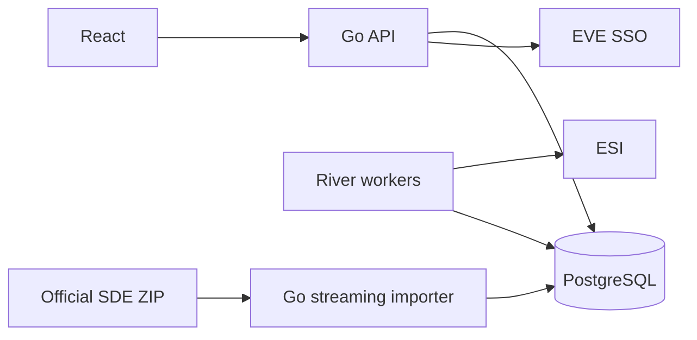

# GloryNavy ESI, SSO and SDE Integration Guide

> Baseline / historical research: recommendations here do not imply delivery. See the [module guides](README.md), [current status](../project-status.md) and [backlog](../backlog.md). Original upstream verification dates are retained.

> SDE type-name imports, a shared name service, Chinese precedence, release activation and automatic updates are implemented; see the [operations guide](sde-names.en.md). The full core/profiles, environment variables, scheduling and failed-release history in sections 9–11 remain extension designs. The dedicated operations guide describes the current implementation.

[中文版](eve-integration.zh-CN.md) · [Official sources and verification](eve-sources.md) · [Technology stack](../tech-stack.md)

Verified: 2026-09-13. This preserves the original implementation design. Configuration names, database entities and workflows are proposed contracts; dedicated operations guides describe delivered components. Protocol facts link to sources; resource budgets are untested starting points.

## 1. Scope and environment

The user has confirmed **Tranquility** as the target environment. This edition uses its official documentation as the project implementation baseline. Include the environment in external identities, authorizations, cache keys and import versions; its current value is tranquility.

ESI supplies dynamic game data; SSO provides character authorization; SDE supplies static reference data such as types, categories and solar systems. SDE does not contain current member assets, wallet journals or historical attendance. Collect these through the relevant APIs or local business workflows. [ESI overview](https://developers.eveonline.com/docs/services/esi/overview/), [SDE documentation](https://developers.eveonline.com/docs/services/static-data/)

## 2. Integration architecture



React calls the local API; game tokens stay in Go. Pages read local data and show synchronization time, completeness and authorization status. During ESI outages, show stale data only to users still authorized to access it. Invalid authorization must not leave private cached data accessible.

Suggested modules: `internal/eve/sso` for authorization; `internal/eve/esi` for HTTP, caching and throttling; `internal/eve/sde` for imports; `internal/jobs` for scheduling; `internal/reports` for aggregation. Keep pgx + sqlc, Goose and River; no additional Redis service is required by this design.

## 3. Configuration and versioning

Proposed configuration, not an implemented environment file:

```dotenv
EVE_ENVIRONMENT=tranquility
EVE_SSO_DISCOVERY_URL=https://login.eveonline.com/.well-known/oauth-authorization-server
EVE_CLIENT_ID=<registered-client-id>
EVE_CLIENT_SECRET=<inject-from-secret-file>
EVE_CALLBACK_URL=https://<your-domain>/api/auth/eve/callback
EVE_TOKEN_KEY_FILE=/run/secrets/eve_token_key
ESI_BASE_URL=https://esi.evetech.net
ESI_COMPATIBILITY_DATE=2026-08-18
ESI_USER_AGENT=GloryNavy/0.1 (contact: <maintainer-email>)
ESI_LANGUAGE=en
ESI_MAX_IN_FLIGHT=2
SDE_METADATA_URL=https://developers.eveonline.com/static-data/tranquility/latest.jsonl
SDE_WORK_DIR=/var/lib/glorynavy/sde
SDE_PROFILE=core
SDE_IMPORT_CONCURRENCY=1
```

`2026-08-18` is the OpenAPI version inspected for this document, not a permanent date. Before implementation, retrieve the pinned specification, record its hash and verify required routes. Send `X-Compatibility-Date` explicitly; do not advance it daily. The API date boundary is 11:00 UTC. Handle newly added fields and enum values compatibly. [Versioning](https://developers.eveonline.com/docs/services/esi/overview/)

The inspected specification uses root paths such as `/characters/{character_id}/assets`. Generate clients from [OpenAPI](https://esi.evetech.net/meta/openapi.json?compatibility_date=2026-08-18), not the outdated `/latest/swagger.json`. Use `/meta/status` for operational health information. [Legacy endpoint retirement](https://developers.eveonline.com/blog/spring-cleaning-legacy-routes-removed-24-march-2026)

Public connectivity check (Bash; use curl.exe in PowerShell and replace the maintainer email):

```bash
curl --fail-with-body --max-time 30 --header 'User-Agent: GloryNavy/0.1 (contact: <maintainer-email>)' --header 'X-Compatibility-Date: 2026-08-18' --header 'X-Tenant: tranquility' --header 'Accept-Language: zh' 'https://esi.evetech.net/universe/systems/30000001'
```

The corresponding HTTP request returned 200, system_id 30000001 and name “坦欧”. A response compatibility date can be earlier than the requested date, reflecting the route version. Do not treat that difference alone as failure or automatically rewrite the application's pinned date. A public check does not validate private authorization.

## 4. SSO registration, binding and token lifecycle

Register the app in the developer portal, register the exact HTTPS callback, and enable only scopes required by enabled modules. Separate development and production configuration. The Go backend uses the confidential-client Authorization Code flow, HTTP Basic client authentication and form-encoded token requests. Validate PKCE S256 with the chosen app registration before enabling it as an enhancement. Never ship the client secret to React. [SSO](https://developers.eveonline.com/docs/services/sso/), [discovery](https://login.eveonline.com/.well-known/oauth-authorization-server)

Project workflow:

1. Generate one-time state using `crypto/rand`, bound to the local session, login/binding intent, requested scopes and a short expiry. Allow only local return paths.
2. Check callback errors, state, expiry and session before exchanging the code. Consume state once. A binding callback must not attach the character to a different local account.
3. Use a maintained JWT library to verify the signature against trusted JWKS, an algorithm allowlist, exact issuer, `exp` and applicable time claims. Require both this client ID and `EVE Online` in `aud`. Validate character identity in `sub` and granted `scp`; check `azp` and `tenant` when present.
4. Default to the reviewed discovery issuer. Accept historical bare-host or trailing-slash forms only through an explicit compatibility allowlist. Do not trust a token-supplied algorithm or remote key URL. Discovery's ID-token HS256 field is not the access-token algorithm policy.
5. Save identity and authorization, then rotate the local session ID for ordinary login. Implemented link/reauthorize flows preserve the authenticating character and session expiry; see [multi-character behavior](seat-multi-character.en.md). Local accounts and game characters are separate entities; names are not identifiers. Where an owner claim is available, record it and quarantine an old binding when it changes. Never inherit the previous local user's permissions automatically; missing expected ownership evidence requires review.

Claim references: [current SSO guide](https://developers.eveonline.com/docs/services/sso/), [older official JWT examples, historical context only](https://docs.esi.evetech.net/docs/sso/validating_eve_jwt.html). Session binding, allowlists and quarantine are project design choices, informed by the [OAuth security BCP](https://www.rfc-editor.org/rfc/rfc9700.html).

Storage: encrypt refresh tokens with authenticated encryption; store key ID, random nonce and ciphertext, with keys outside the database. Encrypt persisted access tokens too. Never log Authorization headers, codes, client secrets, token bodies or full callback query strings. Browsers receive only local HttpOnly, Secure cookies with an appropriate SameSite policy.

Refresh: renew on demand before expiry, with one refresher per authorization. Use a short refresh lease and version comparison rather than holding a database transaction over a network call; the lease must cover the request deadline or be renewed. Atomically store the access token, expiry and any replacement refresh token. Stale workers must not overwrite rotated credentials. Stop on `invalid_grant` and request reauthorization; retain records on transient network failure and use bounded backoff. Handle SSO 429 and Retry-After separately from ESI throttling. [Rotation and throttling notice](https://developers.eveonline.com/blog/sso-endpoint-deprecations-2)

Unbinding first disables local authorization and related work, then attempts remote revocation through discovery. Remove stored ciphertext and audit the operation. Local access removal must not depend on successful remote revocation. Real login, refresh, revocation and issuer compatibility remain integration-test requirements.

## 5. Feature and minimum-scope matrix

Checked against the reviewed [OpenAPI](https://esi.evetech.net/meta/openapi.json?compatibility_date=2026-08-18). Paths are relative to ESI_BASE_URL. Recheck scopes, roles and pagination against the actual compatibility date used in production.

| Feature | Method and path | Scope | Additional constraints |
| --- | --- | --- | --- |
| Character profile | GET `/characters/{character_id}` | None | Public data is not proof of local account ownership |
| Corporation members | GET `/corporations/{corporation_id}/members` | `esi-corporations.read_corporation_membership.v1` | Authorized character belongs to the corporation |
| Corporation roles | GET `/corporations/{corporation_id}/roles` | Same as above | Description requires Personnel Manager or a grantable role; not readable by every member |
| Character assets | GET `/characters/{character_id}/assets` | `esi-assets.read_assets.v1` | Page pagination |
| Corporation assets | GET `/corporations/{corporation_id}/assets` | `esi-assets.read_corporation_assets.v1` | `Director`; page pagination |
| Character journal | GET `/characters/{character_id}/wallet/journal` | `esi-wallet.read_character_wallet.v1` | Pages; description currently specifies 30 days |
| Corporation journal | GET `/corporations/{corporation_id}/wallets/{division}/journal` | `esi-wallet.read_corporation_wallets.v1` | Verify `Accountant` / `Junior_Accountant` and access to the division; pages, 30 days |
| Current fleet | GET `/characters/{character_id}/fleet` | `esi-fleets.read_fleet.v1` | Not being in a fleet is a normal business state |
| Fleet members | GET `/fleets/{fleet_id}/members` | `esi-fleets.read_fleet.v1` | Use a character verified to have read access to that fleet; do not assume any member qualifies |
| Recent killmails | GET `/characters/{character_id}/killmails/recent` | `esi-killmails.read_killmails.v1` | Pages; description currently specifies 90 days |
| Killmail detail | GET `/killmails/{killmail_id}/{killmail_hash}` | None | Requires a valid ID and hash; local display still follows business permissions |
| Structure detail | GET `/universe/structures/{structure_id}` | `esi-universe.read_structures.v1` | Also requires structure ACL access |

Separate login, asset, finance and fleet authorization. OAuth scopes, in-game roles and local RBAC are independent requirements. Revoke affected capabilities when consent, membership or roles change. This design does not request fleet write scopes or other in-game action permissions.

## 6. ESI HTTP, caching and throttling

Use a shared HTTP client with connection reuse, connection/header/overall deadlines and bounded response/decompressed sizes. Send an application User-Agent with maintainer contact information. Private requests use Bearer headers, never token query parameters.

Cache identity includes environment, method, path, normalized query/body hash, compatibility date, language and authorization data scope. Never share private responses by URL alone. Tokens are not loggable cache keys. Record ETag, Last-Modified, Cache-Control, Expires and successful local commit time. [Caching guidance](https://developers.eveonline.com/docs/services/esi/best-practices/)

| Result | Project handling |
| --- | --- |
| 200 / other expected success | Validate response structure; commit data before advancing cache metadata |
| 304 | Reuse the matching stored page and update check time; never interpret as an empty array. If the local response was lost, fetch without its old validator |
| 400/422 | Correct the request; do not retry continuously |
| 401 | At most one coordinated refresh and retry; otherwise mark authorization unhealthy |
| 403 | Diagnose scope, role, ACL and local access; pause the capability rather than repeatedly refreshing |
| 404 | Interpret per route, such as missing resource or no current fleet; never delete an entire local collection on this basis |
| 420 | Pause ESI requests globally until the error-limit reset |
| 429 | Respect Retry-After, including responses without group headers; never rotate identities to evade throttling |
| 5xx/timeout | Bounded exponential backoff with jitter; retain the previous successful data |

Revalidate with `If-None-Match` when refresh is allowed; never bypass caches with random parameters. New-limit routes expose `X-Ratelimit-Group/Limit/Remaining/Used`. Older routes expose `X-ESI-Error-Limit-Remain/Reset`; both sets need not be present together. New-system response costs are 2xx=2, 3xx=1, 4xx=5 except 429, and 5xx=0, so a 304 is not free. [Rate limits](https://developers.eveonline.com/docs/services/esi/rate-limiting/)

Obtain capacity from `x-rate-limit` and response headers, not one global requests-per-second constant. Authenticated buckets include app/character identity; public buckets primarily depend on egress IP. Also share the application's global error budget. Deduplicate corporation-wide collection across authorizing members. Automatically retry only operations known to be safe to repeat.

## 7. Pagination and synchronization correctness

For page-based routes, follow `page` and `X-Pages`, keeping per-page validators, counts and Last-Modified. Missing/changing pagination metadata or mismatched page timestamps make the run incomplete and require a bounded restart. Partial results are not a full snapshot. Validators reduce mixed-version risk but do not establish a transactional upstream snapshot. [Cache consistency](https://developers.eveonline.com/docs/services/esi/best-practices/)

For cursor routes, start without pagination parameters, retain the initial after token and backfill using before. Then follow after for changes. Store opaque tokens unchanged. A short nonempty page is not the end; an empty collection is. Older before duplicates must not overwrite newer data; after updates may replace it. Commit records and cursor advancement in one transaction, and detect non-advancing cursor loops. [Cursor guide](https://developers.eveonline.com/docs/services/esi/pagination/cursor-based/), [pagination announcement](https://developers.eveonline.com/blog/changing-pagination-turning-a-new-page)

Project synchronization model:

- Snapshot resources such as members/assets are staged in batches under sync_run_id. Publish only complete successful runs. Crashes or failed pages preserve the old snapshot; page-count or membership changes require full validation.
- Journals are idempotent on `(environment, owner_kind, owner_id, division, entry_id)` with a consistent non-null default division where inapplicable. Killmails deduplicate by environment and killmail ID. Do not delete archived history merely because it falls outside the upstream window.
- Schedule the next request after the maximum of business interval, cache expiry and throttle recovery, with jitter. One layer owns the retry budget so HTTP and River attempts do not multiply uncontrollably.
- River job arguments contain authorization/resource IDs and cursor references, never tokens. Local business writes and enqueueing can share a pgx transaction. [River](https://riverqueue.com/docs/transactional-enqueueing)

## 8. Suggested PostgreSQL model

| Entity | Main contents |
| --- | --- |
| eve_authorizations | Local user, environment, character, owner evidence, scopes, encrypted tokens, expiry, version and status |
| esi_sync_state | Resource and authorization scope, last success, next run, cursor, completeness and error class |
| esi_cached_pages | Request fingerprint, page/cursor, ETag, expiry, stored response or snapshot reference |
| esi_sync_runs | Run ID, start/end, processed pages, result and active snapshot |
| sde_releases | Environment, build, profile, mapper_version, download metadata, local SHA-256, status, counts and validation report |
| sde_active_release | Current release_id for each environment/profile; references a validated release only |
| sde_types / sde_groups / sde_categories | Versioned reference data keyed by `(release_id, external_id)` |
| sde_translations | `(release_id, entity_kind, external_id, language)` and localized text |

Use BIGINT IDs, string IDs in the API, NUMERIC/exact decimal amounts and UTC timestamptz. Never route external integer IDs or financial totals through float64. Do not require dynamic records to reference a row in the current SDE release: delayed static releases must not block business ingestion.

## 9. SDE source, files and import scope

Use the official JSONL ZIP, not old tutorials' bsd/universe directories or third-party converted SQL. The layout changed. Read record keys from `_key`; some non-object values use `_value`. [Format and automation](https://developers.eveonline.com/docs/services/static-data/), [SDE rework](https://developers.eveonline.com/blog/reworking-the-sde-a-fresh-start-for-static-data)

Metadata: `https://developers.eveonline.com/static-data/tranquility/latest.jsonl`. Pinned archive: `https://developers.eveonline.com/static-data/tranquility/eve-online-static-data-<build>-jsonl.zip`. Find buildNumber in the `_key == "sde"` record; do not treat an entire JSONL file as a single JSON object. See the [verification record](eve-sources.md) for inspected builds and samples.

| Profile | Files | Purpose |
| --- | --- | --- |
| core | `_sde.jsonl`, `categories.jsonl`, `groups.jsonl`, `types.jsonl` | Build metadata, ship/equipment categories and names |
| core | `mapRegions.jsonl`, `mapConstellations.jsonl`, `mapSolarSystems.jsonl` | Locations for attendance/killmail reports |
| core | `translationLanguages.jsonl` | Language-key verification |
| market, optional | `marketGroups.jsonl` | Market classification, not live prices |
| fitting, optional | `dogmaAttributes.jsonl`, `dogmaEffects.jsonl`, `typeDogma.jsonl`, `dogmaUnits.jsonl` | Attributes and fitting analysis |
| industry, optional | `blueprints.jsonl`, `typeMaterials.jsonl` | Industry recipes and materials |
| locations, optional | `npcStations.jsonl` and dependencies | NPC stations; do not assume a direct name field |

Parse only enabled profiles. Do not indiscriminately remove unpublished or key-zero records from core data: references may depend on them. Preserve unresolved IDs and show identifiable placeholders. Queue bounded static lookups rather than calling ESI on every page render.

## 10. Initial SDE import

This is the future importer's operational contract, not an existing CLI.

1. **Preflight:** check PostgreSQL backups, disk capacity, profile dependencies and mapper version. Acquire a single-import lease. On 4C4G, allow only one SDE import and pause competing heavy exports/aggregations.
2. **Pin the source:** conditionally retrieve metadata, record build and releaseDate, and read the schema changelog. Download the pinned build URL to `.part` with deadlines, retry and size limits. Rename atomically only after completion. Do not fetch a moving latest ZIP after checking a fixed build.
3. **Validate the archive:** verify ZIP readability and entry size/compression-ratio bounds. Read selected entries to EOF to verify CRC, and match `_sde` against the selected build. Compute a local SHA-256 for reproducibility; it is not an official authenticity signature. Reject traversal paths, duplicate critical entries and missing required files. Prefer allowlisted entry reads over extracting everything.
4. **Create a release:** insert an importing `sde_releases` row with a release_id distinct from build and record profile/mapper_version. Continue serving the old release. Never TRUNCATE CASCADE production reference or business data.
5. **Stream parsing:** use Go archive/zip plus bounded line reading or json.Decoder; never load entire ZIP/JSONL/YAML datasets into RAM. For bufio.Scanner, explicitly raise its line limit above the default 64KiB and check Err. Use typed integers or UseNumber. Distinguish absent, null, zero and false values; tolerate additive unknown fields.
6. **Map and write:** process categories → groups → types and regions → constellations → systems; split translations into rows. Use pgx COPY into the new release's tables/staging tables. Start with batches bounded by 1,000 rows or roughly 4MiB, whichever comes first, then measure. COPY is not upsert. Restart with a fresh release or clean the failed batch so retries cannot duplicate primary keys. [pgx](https://github.com/jackc/pgx)
7. **Validate data:** check unique keys, parent references, required fields, count changes, language coverage and known samples. Zero rows or unexplained sharp declines block activation. Record skipped/failed rows per file; never silently interpret parse failure as empty data. Build required indexes and ANALYZE.
8. **Activate:** in a short transaction, lock the active pointer, verify the new release passed validation and has not been superseded, atomically switch release_id and mark ready. Queries across tables pin one release_id; update versioned caches after activation.
9. **Finish:** retain the previous release for rollback; record duration, row counts, peak memory and disk usage; release the lease. Check for running reports/exports referencing a release before deleting it.

Budget disk for the archive, old/new datasets and indexes, WAL, temporary files and backup headroom. The approximately 99MB inspected ZIP does not establish total requirements. Support cancellation, progress and failure reports. Downloads must not occupy an open database transaction.

## 11. SDE updates, changes and rollback

Project starting policy: check metadata every six hours with jitter and allow manual checks. This is not an official required frequency. Use ETag/Last-Modified; skip unchanged builds unless profile or mapper changes require a new import. Initially rebuild the selected datasets as a new release; this is easier to validate than row-level incremental maintenance.

Official change files list changed keys; `_meta.lastBuildNumber` links the preceding build. They are not generic JSON Patch or guaranteed full replacement rows. Do not upsert those keys as records. A later incremental importer must validate the build chain, retrieve replacement data from the pinned archive, handle deletions and validate dependencies. Fall back to a full import for broken chains or structural changes. [Automation](https://developers.eveonline.com/docs/services/static-data/), [inspected change file](https://developers.eveonline.com/static-data/tranquility/changes/3503375.jsonl)

Failed releases never become active. Rollback switches the active pointer to a retained ready release and updates versioned caches; it does not roll back business records. Delete expired releases in bounded batches by release_id without cascading into business tables. Long reports pin a release to avoid mixing static versions in one export.

## 12. Chinese and English data

The guide has Chinese and English editions; static records retain both `zh` and `en`. Map UI locale `zh-CN` to SDE/ESI `zh`, not to a literal zh-CN source field. Fall back from missing Chinese to English, then to an identifiable placeholder such as `Unknown type <ID>`. Never persist an English fallback as if it were an official Chinese translation. Search should accept Chinese names, English names and exact IDs.

Language is not part of the entity identity; translations have separate rows. UI language changes must not trigger a full asset resynchronization. Use ESI language options according to each route and separate language-sensitive caches. Translation must not alter IDs, quantities or amounts. Escape or sanitize SDE descriptions as untrusted rich text.

## 13. Attendance, SRP and reporting boundaries

Current fleet membership is not historical attendance. During an activity, sample within cache and rate constraints, recording sample time, source and completeness. Collection gaps mean unknown attendance, not automatic absence; manual corrections require audit records.

Wallet journals and recent killmails have bounded history, described as 30/90 days in the inspected routes. Long-range reporting requires ongoing local archival; first deployment cannot promise complete historical backfill. SRP amounts come from project rules or a separately verified pricing source; SDE does not provide live market prices.

Join dynamic type_id/system_id values against a pinned SDE release. Record data cutoff, collection completeness and metric definitions. Charts and exports follow the [overall UI rules](../ui-design-rules.md) and enforce RBAC and corporation data scopes.

## 14. Operations and incident handling

Initial settings: two ESI requests in flight, two total heavy workers, one export, and one SDE import mutually exclusive with other heavy work. Start with a shared query pool of ten, separately budgeting listener/maintenance connections. These values are not capacity guarantees.

Observe request status/latency, group capacity, error budget, last success, queue lag, invalid authorizations, active SDE release, import failures, disk and memory. Logs contain only nonsensitive identifiers and error classes.

| Situation | Action |
| --- | --- |
| Rising SSO failures | Separate invalid_grant from service failure, stop refresh storms and request reauthorization where appropriate |
| ESI throttle/outage | Delay work using headers; consult `/meta/status`; show authorized stale data with timestamps |
| Sudden dataset shrink | Freeze snapshot publication and check pagination, scopes, roles and upstream changes |
| Changed SDE archive/schema | Fail the candidate release, retain the active one and retry after updating the mapper |
| Low disk | Stop before download/activation; remove expired files by policy, never the only usable release |

## 15. Implementation order and acceptance

Order: app registration and SSO → public character profile → corporation membership → core SDE → authorization/sync status UI → fleets/killmails → optional assets/finance → aggregates and exports.

Before release, verify:

- Reject mismatched/expired/reused state, cross-account binding and wrong signature/issuer/audience/tenant. Confirm real granted scopes.
- Concurrent refresh yields one valid commit; stale work cannot overwrite rotation. Revocation removes task and page access. Logs contain no credentials.
- A 304 preserves data; a failed page cannot publish a snapshot; cursor advancement is atomic with data; 401/403/420/429/5xx handling respects budgets.
- Truncated ZIPs, bad CRC, long lines, unknown/missing fields, duplicate keys, empty datasets and broken references produce explicit outcomes. Failed imports preserve the old release.
- Chinese/English fallback and ID/amount precision work. Activation/rollback work; long exports retain one release.
- Test migrations, COPY, transactions and recovery against real PostgreSQL. Measure peak resource usage and page latency during concurrent sync/export on the target 4C4G host.

This research checked official sources, OpenAPI, one public Chinese-language API request and selected ZIP samples. It did not exercise real authorization, private endpoints, full imports or load tests. See the [verification record](eve-sources.md).
