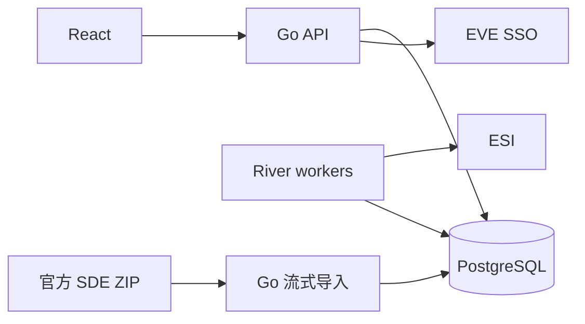

# GloryNavy ESI、SSO 与 SDE 接入指南

> 接入基线 / 历史调研：本文包含当时建议，不等于全部已实现。当前模块指南见[接入目录](README.md)，当前版本与待办见[项目状态](../project-status.md) / [待办](../backlog.md)。上游核验日期保留原记录。

> 当前 SDE 已交付 `type-names` 的导入、统一名称服务、中文优先、版本切换与自动更新，运行命令见[SDE 名称指南](sde-names.zh-CN.md)。本文第 9–11 节的完整 core/profile、环境变量、调度及 failed 状态记录仍为扩展方案，以专门运行指南为当前实现基准。

[English](eve-integration.en.md) · [官方来源与核验记录](eve-sources.md) · [技术栈](../tech-stack.md)

核验日期：2026-09-13。本文保留当时的整体设计；配置名、数据库实体和流程为建议契约，已交付部分以对应运行指南为准。官方协议事实附来源，资源预算属于待测起点。

## 1. 范围与环境

用户已确认接入 **Tranquility 国际服**，本版依据该环境官方资料编写，作为项目实现基线。所有外部 ID、令牌、缓存和导入版本须包含服务器环境维度，当前固定为 tranquility。

ESI 提供动态游戏数据，SSO 提供角色授权，SDE 提供类型、分类、星系等静态资料。SDE 不包含成员当前资产、钱包流水或历史出勤；这些数据应从相应接口或本地业务流程采集。[ESI 概览](https://developers.eveonline.com/docs/services/esi/overview/)、[SDE 文档](https://developers.eveonline.com/docs/services/static-data/)

## 2. 项目接入架构



React 只访问本站 API；游戏令牌保留在 Go 后端。页面读取本地业务数据，展示同步时间、数据完整性及授权状态。ESI 暂时不可用时可展示有权限访问的旧数据并注明过期；授权失效后不得继续向无权限用户暴露缓存。

建议模块：`internal/eve/sso` 管理授权；`internal/eve/esi` 统一 HTTP、缓存与限流；`internal/eve/sde` 导入静态资料；`internal/jobs` 调度；`internal/reports` 统计。沿用 pgx + sqlc、Goose、River，不新增 Redis 服务。

## 3. 配置与版本

以下是拟定配置，不是已经可运行的环境文件：

```dotenv
EVE_ENVIRONMENT=tranquility
EVE_SSO_DISCOVERY_URL=https://login.eveonline.com/.well-known/oauth-authorization-server
EVE_CLIENT_ID=<registered-client-id>
EVE_CLIENT_SECRET=<inject-from-secret-file>
EVE_CALLBACK_URL=https://<your-domain>/api/auth/eve/callback
EVE_TOKEN_KEY_FILE=/run/secrets/eve_token_key
ESI_BASE_URL=https://esi.evetech.net
ESI_COMPATIBILITY_DATE=2026-08-18
ESI_USER_AGENT=GloryNavy/0.1 (contact: <maintainer-email>)
ESI_LANGUAGE=en
ESI_MAX_IN_FLIGHT=2
SDE_METADATA_URL=https://developers.eveonline.com/static-data/tranquility/latest.jsonl
SDE_WORK_DIR=/var/lib/glorynavy/sde
SDE_PROFILE=core
SDE_IMPORT_CONCURRENCY=1
```

`2026-08-18` 是本次核对 OpenAPI 得到的版本，不是永久锁定日期；实现前再次下载该日期的规范、保存哈希，并验证所需接口。请求显式设置 `X-Compatibility-Date`，不要每天自动改为今天。兼容日期切换边界为 11:00 UTC；未知新增字段和枚举应有兼容处理。[版本规则](https://developers.eveonline.com/docs/services/esi/overview/)

本次规范使用根路径，如 `/characters/{character_id}/assets`。新实现以 [OpenAPI](https://esi.evetech.net/meta/openapi.json?compatibility_date=2026-08-18) 为契约，不从过时的 `/latest/swagger.json` 生成客户端；运维健康信息使用 `/meta/status`。[旧端点退役公告](https://developers.eveonline.com/blog/spring-cleaning-legacy-routes-removed-24-march-2026)

公共连通性检查示例（Bash；PowerShell 中使用 curl.exe，替换维护者邮箱）：

```bash
curl --fail-with-body --max-time 30 --header 'User-Agent: GloryNavy/0.1 (contact: <maintainer-email>)' --header 'X-Compatibility-Date: 2026-08-18' --header 'X-Tenant: tranquility' --header 'Accept-Language: zh' 'https://esi.evetech.net/universe/systems/30000001'
```

本次对应 HTTP 请求返回 200，system_id 为 30000001，name 为“坦欧”。响应兼容日期可以早于请求日期，表示该路由使用的版本；不要把这种差异直接视为请求失败，也不要用它自动改写应用的固定日期。公共测试不能证明私有权限配置正确。

## 4. SSO 注册、绑定与令牌生命周期

在开发者门户注册应用、精确登记 HTTPS 回调地址，并只启用对应模块需要的 scope。开发与生产分开配置。Go 后端采用保密客户端 Authorization Code 流程，通过 HTTP Basic 验证客户端，token 请求使用表单 body；PKCE S256 作为增强项在注册配置下验证后启用，不把客户端密钥放入 React。[SSO](https://developers.eveonline.com/docs/services/sso/)、[发现元数据](https://login.eveonline.com/.well-known/oauth-authorization-server)

项目流程：

1. 使用 `crypto/rand` 创建一次性 state，绑定本站会话、登录/绑定意图、请求 scope 和短有效期；回跳位置仅允许本站路径。
2. 回调先检查错误、state、时效及会话，再交换 code；state 消费后不可复用。正在登录的用户绑定角色时，不允许回调改绑其他本站账户。
3. 使用成熟 JWT 库验证签名及受信 JWKS、算法白名单、精确 issuer、`exp` 和适用时间声明；`aud` 同时包含本应用 client ID 与 `EVE Online`。校验 `sub` 的角色 ID 和授权 `scp`；如有 `azp`/`tenant` 也核对应用及环境。
4. issuer 默认以已核实的发现元数据为准。旧 bare-host 或尾斜杠形式只通过显式兼容白名单接受。不能直接相信 token 自带的算法或远程密钥 URL；不把发现元数据的 ID-token HS256 字段当作 access token 算法配置。
5. 保存角色身份及授权，普通登录刷新本站会话 ID；已实现的绑定/重新授权保留原认证角色和会话到期时间，见[多角色说明](seat-multi-character.zh-CN.md)。本站账户和游戏角色分开建模；相同名字不代表同一角色。若提供 owner 标识，记录并在其变化时隔离旧绑定，不能自动继承旧用户权限；缺少预期标识时进入人工核对流程。

签名与声明依据：[当前 SSO 说明](https://developers.eveonline.com/docs/services/sso/)、[旧版官方声明示例，仅作兼容背景](https://docs.esi.evetech.net/docs/sso/validating_eve_jwt.html)。会话绑定、白名单与隔离是本项目设计，安全背景参见 [OAuth BCP](https://www.rfc-editor.org/rfc/rfc9700.html)。

令牌存储：refresh token 使用带认证的加密，记录 key ID、随机 nonce 和密文；密钥在数据库外。若持久化 access token，也加密。禁止记录 Authorization、code、client secret、token body 或完整回调查询串。浏览器只持有 HttpOnly、Secure、适当 SameSite 的本站 Cookie。

刷新：在过期前按需获取新 token，同一授权只允许一个刷新者。使用短期刷新租约和版本比较，避免长时间持有数据库事务等待网络；租约必须覆盖请求时限或续约。成功后原子保存新 access token、过期时间及返回的新 refresh token，防止旧任务覆盖轮换结果。`invalid_grant` 停止自动刷新并要求重新授权；网络失败保留旧记录，有限退避；SSO 的 429 单独遵循 Retry-After。[令牌轮换与限流公告](https://developers.eveonline.com/blog/sso-endpoint-deprecations-2)

解绑时先禁用本地授权并停止相关任务，再使用发现的 revocation endpoint 尽力撤销；清理密文并审计操作。权限检查不得依赖撤销远端成功。真实登录、刷新、撤销和 issuer 兼容仍需开发测试。

## 5. 功能与最小授权矩阵

下表核对自本次 [OpenAPI](https://esi.evetech.net/meta/openapi.json?compatibility_date=2026-08-18)；路径均相对 ESI_BASE_URL。scope、角色要求和分页方式按实际启用日期重新核验。

| 功能 | 方法与路径 | scope | 附加约束 |
| --- | --- | --- | --- |
| 角色资料 | GET `/characters/{character_id}` | 无 | 公共资料不是本站账户所有权凭证 |
| 军团成员 | GET `/corporations/{corporation_id}/members` | `esi-corporations.read_corporation_membership.v1` | 授权角色属于该军团 |
| 军团职务 | GET `/corporations/{corporation_id}/roles` | 同上 | 文档要求 Personnel Manager 或可授予职务；不等于所有成员可读 |
| 角色资产 | GET `/characters/{character_id}/assets` | `esi-assets.read_assets.v1` | page 分页 |
| 军团资产 | GET `/corporations/{corporation_id}/assets` | `esi-assets.read_corporation_assets.v1` | `Director`；page 分页 |
| 角色流水 | GET `/characters/{character_id}/wallet/journal` | `esi-wallet.read_character_wallet.v1` | page；当前说明为近 30 天 |
| 军团流水 | GET `/corporations/{corporation_id}/wallets/{division}/journal` | `esi-wallet.read_corporation_wallets.v1` | 核对 `Accountant` / `Junior_Accountant` 及目标钱包访问；page，近 30 天 |
| 当前舰队 | GET `/characters/{character_id}/fleet` | `esi-fleets.read_fleet.v1` | 不在舰队为正常业务状态 |
| 舰队成员 | GET `/fleets/{fleet_id}/members` | `esi-fleets.read_fleet.v1` | 使用经验证具有该舰队读取权限的授权角色；不假定普通成员都可读 |
| 最近击毁 | GET `/characters/{character_id}/killmails/recent` | `esi-killmails.read_killmails.v1` | page；当前说明为近 90 天 |
| 击毁详情 | GET `/killmails/{killmail_id}/{killmail_hash}` | 无 | 需要合法 ID 和 hash；在本站仍按业务权限展示 |
| 建筑资料 | GET `/universe/structures/{structure_id}` | `esi-universe.read_structures.v1` | 还要求建筑 ACL 访问 |

登录、资产、财务、舰队分开授权，不一次申请全部 scope；scope 与游戏内职务、本站 RBAC 是三层独立条件。scope 撤销、离团、职务变化后及时撤销对应能力。当前不申请舰队写入或其他游戏操作权限。

## 6. ESI HTTP、缓存与限流

统一 HTTP 客户端：复用 Transport；设置连接、响应头和整体超时；限制响应体和解压后大小；每次请求携带可联系维护者的 User-Agent。私有请求用 Bearer header，不通过 URL 传 token。

缓存键至少包含环境、method、path、规范化 query/body hash、兼容日期、语言及授权数据范围。私有数据不得只按 URL 共享缓存；不把 token 本身作为日志或可见缓存键。记录 ETag、Last-Modified、Cache-Control、Expires 及数据成功落库时间。[缓存规则](https://developers.eveonline.com/docs/services/esi/best-practices/)

| 结果 | 项目处理 |
| --- | --- |
| 200/其他预期成功 | 校验响应结构；提交数据后更新缓存元数据 |
| 304 | 使用对应页面已保存的数据并更新检查时间；不按空数组处理。丢失本地响应时，不带旧验证器重新获取 |
| 400/422 | 修正请求，不自动持续重试 |
| 401 | 至多进行一次协调刷新并重试；仍失败则标记授权异常 |
| 403 | 区分 scope、职务、ACL 和本站权限；暂停该能力，不无限刷新 |
| 404 | 按接口含义处理缺失/不在舰队；不能据此删除整批本地数据 |
| 420 | 全局暂停 ESI 请求，按错误限流 reset 恢复 |
| 429 | 尊重 Retry-After；即使缺少组头也要退避，不通过换角色规避限流 |
| 5xx/超时 | 有上限的指数退避加随机抖动；本轮失败保留上次成功数据 |

到缓存可刷新时间后用 `If-None-Match` 条件请求；不要增加随机参数绕过缓存。新限流按组及调用者分桶，读取 `X-Ratelimit-Group/Limit/Remaining/Used`；旧机制读取 `X-ESI-Error-Limit-Remain/Reset`，两类头不一定同时出现。新机制状态成本为 2xx=2、3xx=1、4xx=5（429 例外）、5xx=0，因此 304 仍非免费。[限流说明](https://developers.eveonline.com/docs/services/esi/rate-limiting/)

每组容量来自规范 `x-rate-limit` 和响应头，不硬编码成统一每秒次数。新机制认证桶包含 application/character，公共桶主要基于出口 IP；应用还需共享全局错误预算。本项目统一调度，同一军团资源避免由多个成员重复全量拉取。只对已判定可安全重试的操作自动重试。

## 7. 分页与同步正确性

page 接口按实际 `page` 参数和 `X-Pages` 拉取，保留每页验证器、页数及 Last-Modified。缺失/变化的分页信息或跨页时间不一致时标记不完整并有限重做，不能把已取到的部分当作全量。校验器只能降低混合版本风险，不能声称获取了上游事务快照。[缓存一致性说明](https://developers.eveonline.com/docs/services/esi/best-practices/)

游标接口首次从无参数页开始，保留其 after，使用 before 回溯；完成后用 after 追增量。游标原样保存，非空短页不代表结束；返回空集合才到边界。before 重复记录不覆盖较新数据，after 更新可以替换。每次落库与游标推进放在同一事务中；防止游标不推进造成死循环。[游标指南](https://developers.eveonline.com/docs/services/esi/pagination/cursor-based/)、[分页公告](https://developers.eveonline.com/blog/changing-pagination-turning-a-new-page)

项目同步模型：

- 快照资源（成员、资产）使用 sync_run_id 分批暂存，仅完整成功后切换活动快照。任务崩溃或部分页失败不删除旧快照；页数变化及成员离团需要完整核验。
- 流水资源按 `(environment, owner_kind, owner_id, division, entry_id)` 幂等存储，缺省 division 使用一致的非空值；击毁按环境与 killmail ID 去重。上游窗口外记录不因本轮未返回而删除。
- 下一次执行取业务间隔、缓存失效时间和限流恢复时间的最大值，加抖动。一个调度层负责重试预算，避免 HTTP 与 River 重试相乘。
- River 任务参数只存授权 ID、资源 ID、同步游标引用，不存 token。提交业务变化与入队可共享 pgx 事务。[River](https://riverqueue.com/docs/transactional-enqueueing)

## 8. PostgreSQL 数据模型建议

| 实体 | 关键内容 |
| --- | --- |
| eve_authorizations | 本站用户、环境、角色、owner 标识、scopes、加密 token、过期时间、版本与状态 |
| esi_sync_state | 资源及授权范围、最后成功时间、下次执行时间、游标、完整性和错误分类 |
| esi_cached_pages | 请求指纹、页/游标、ETag、有效期、已保存响应或对应快照引用 |
| esi_sync_runs | 执行 ID、开始/结束时间、已处理页数、成功/失败及活动快照 |
| sde_releases | 环境、build、profile、mapper_version、下载元数据、本地 SHA-256、状态、行数与校验报告 |
| sde_active_release | 每个环境/profile 的当前 release_id，仅指向已校验版本 |
| sde_types / sde_groups / sde_categories | 以 `(release_id, external_id)` 为主键的版本化静态数据 |
| sde_translations | `(release_id, entity_kind, external_id, language)` 与本地化文本 |

业务 ID 用 BIGINT，API 以字符串传输；金额用 NUMERIC/精确十进制；时间使用 UTC timestamptz。不使用 float64 中转外部整数 ID 或财务合计。不强制把动态资料外键绑定到“当前 SDE”中的某一行，避免发布延迟导致业务写入失败。

## 9. SDE 来源、文件与导入范围

使用官方 JSONL ZIP，而非旧教程的 bsd/universe 目录或第三方预转换 SQL。新 SDE 已改变布局；从 `_key` 取记录键，部分非对象值使用 `_value`。[格式与自动化](https://developers.eveonline.com/docs/services/static-data/)、[重构说明](https://developers.eveonline.com/blog/reworking-the-sde-a-fresh-start-for-static-data)

元数据路径：`https://developers.eveonline.com/static-data/tranquility/latest.jsonl`；固定构建下载路径：`https://developers.eveonline.com/static-data/tranquility/eve-online-static-data-<build>-jsonl.zip`。读取 `_key == "sde"` 的 buildNumber，不把整个 JSONL 文件当单个 JSON 对象。示例构建与样本见 [核验记录](eve-sources.md)。

| Profile | 文件 | 用途 |
| --- | --- | --- |
| core | `_sde.jsonl`、`categories.jsonl`、`groups.jsonl`、`types.jsonl` | 构建信息、舰船/装备分类及名称 |
| core | `mapRegions.jsonl`、`mapConstellations.jsonl`、`mapSolarSystems.jsonl` | 地点与出勤/击毁报表 |
| core | `translationLanguages.jsonl` | 语言键核对 |
| market，可选 | `marketGroups.jsonl` | 市场分类；不提供实时价格 |
| fitting，可选 | `dogmaAttributes.jsonl`、`dogmaEffects.jsonl`、`typeDogma.jsonl`、`dogmaUnits.jsonl` | 属性与装配分析 |
| industry，可选 | `blueprints.jsonl`、`typeMaterials.jsonl` | 工业配方及材料 |
| locations，可选 | `npcStations.jsonl` 及其依赖 | NPC 空间站；不假定有直接 name 字段 |

只解析启用 profile，但 core 中不随意删除 unpublished 或键为 0 的记录，以免破坏引用。未知 ID 显示可识别占位并保留原值；静态补查应受控排队，不在每次页面渲染时调用 ESI。

## 10. SDE 初次导入流程

以下是待实现导入器的操作规范，不是现有 CLI 命令。

1. **预检**：确认 PostgreSQL 备份、磁盘空间、profile 依赖和 mapper 版本；获取单实例导入租约。4C4G 上默认只跑一个 SDE 导入，暂停其他重导出/汇总任务。
2. **固定来源**：条件获取元数据，记录 build 与 releaseDate，读取 schema changelog。下载固定构建 URL 至 `.part`，设置超时、重试和体积上限；只有完整下载后才原子改名。不要在元数据检查后又下载可能已变更的 latest ZIP。
3. **校验包**：检查 ZIP 可读性、条目尺寸与压缩比上限；逐项读取到 EOF 验证 CRC，确认 `_sde` 构建号匹配。计算本地 SHA-256 用于复现；本地哈希不是官方真实性签名。拒绝路径穿越、重复关键条目或缺失必需文件；优先按白名单直接读取条目，不全量解压。
4. **创建新版本**：插入 `sde_releases`，状态 importing；release_id 独立于 build，并记录 profile 和 mapper_version。旧活动版本继续提供服务。不要在生产数据上执行 TRUNCATE CASCADE。
5. **流式解析**：Go 使用 archive/zip 加有界逐行读取或 json.Decoder；不要把完整 ZIP/JSONL/YAML 放入内存。若用 bufio.Scanner，显式设置大于默认 64KiB 的行上限并检查 Err。整数使用显式类型或 UseNumber；缺失、null、0、false 分开处理，未知附加字段兼容。
6. **映射与写入**：按 categories → groups → types、regions → constellations → systems 顺序处理；语言字段拆行。使用 pgx COPY 写新 release 的表/暂存表，批次先以 1,000 行或约 4MiB 中先到者提交，再实测调整。COPY 不是 upsert；重跑使用新 release 或清理该失败批次，不能产生重复主键。[pgx](https://github.com/jackc/pgx)
7. **验证**：校验键唯一、父子引用、必需字段、行数变化、语言覆盖和固定样本；零记录或异常下降必须阻止激活。按文件统计跳过/失败行；不得把解析错误静默当空数据。建必要索引并 ANALYZE。
8. **激活**：在短事务内锁定活动指针，确认新版本已验证且未被更新版本替代，原子切换 release_id，并标记 ready。所有表查询固定同一个 release_id；切换后更新带版本号的缓存。
9. **收尾**：保留前一版本用于回滚，记录耗时、行数、峰值内存和磁盘占用，释放租约。清理过期版本前确认没有长报表/导出仍引用它。

空间预算至少包含压缩包、新旧版本及索引、WAL、临时文件和备份余量，不能由约 99MB 的样本 ZIP 推断总容量。导入器应支持取消、进度和失败报告；网络下载不要占住数据库事务。

## 11. SDE 更新、变更与回滚

项目建议每 6 小时带抖动检查构建元数据，并支持管理员手动检查；不是官方要求的刷新频率。利用 ETag/Last-Modified，构建相同则跳过；profile 或 mapper 变化时允许同 build 重新导入。首次实现使用“选定数据集全量建新版本”，比逐行增量更容易核验。

官方 changes 文件包含变更键，`_meta.lastBuildNumber` 指向前一构建，不是通用 JSON Patch，也不保证包含完整新行。不能把这些键直接 upsert。后续做增量时必须验证构建链、从对应固定 ZIP 取新数据、处理删除并复核依赖；链断裂或结构变化退回全量。[自动化说明](https://developers.eveonline.com/docs/services/static-data/)、[核对的变更文件](https://developers.eveonline.com/static-data/tranquility/changes/3503375.jsonl)

失败版本不得成为活动版本。回滚只把活动指针切回保留的 ready 版本，再使版本缓存更新；不回滚用户业务记录。清理需按 release_id 分批执行，不使用影响业务表的级联删除。报表执行期间固定 release_id，避免同次导出混用两个 SDE 版本。

## 12. 中英文数据与显示

本指南提供中英文版本；静态资料也保留 `zh` 与 `en`。UI 的 `zh-CN` 映射到 SDE/ESI 的 `zh`，不能原样当作数据字段名。中文缺失回退英文，再回退 `Unknown type <ID>` 等占位；不能把英文回退值伪存为官方中文翻译。搜索允许中文名、英文名和精确 ID。

语言不进入实体身份主键；翻译单独存储，同步任务不要因切换 UI 语言重拉所有资产。ESI 的语言选项按接口规范使用，缓存键必须区分语言。名称翻译不改变 ID、数量或金额。SDE 内描述按不可信富文本处理，展示时转义或清理。

## 13. 出勤、补损与报表边界

ESI 的当前舰队成员列表不是历史出勤报表：本项目在活动期间按缓存和限流允许的频率采样，并保存采样时间、来源及完整性。采集暂停的时段标为未知，不能自动视为缺勤；补录另行审计。

钱包和 killmail 接口的历史窗口有限（本次分别见 30/90 天描述）；长周期报表依赖上线后的持续归档，不能承诺首次部署补齐全部历史。补损金额来自项目规则或另行核验的价格来源；SDE 不提供实时市场价格。

报表关联动态记录的 type_id/system_id 与指定 SDE release；保留数据截止时间、同步完整性和统计口径。图表和导出遵循 [整体 UI 规则](../ui-design-rules.md)，对外仍执行 RBAC 与军团范围校验。

## 14. 运行与故障处置

初始建议：ESI 总在途请求 2、重任务总并发 2、导出 1、SDE 导入 1 且与其他重任务互斥；共享查询池起点 10，并额外预算监听/维护连接。以上不是容量承诺。

监控请求状态/延迟、分组剩余额度、错误预算、最后成功时间、队列等待、授权失效数、SDE 活动版本、导入失败、磁盘和内存。日志只记非敏感资源标识与错误分类。

| 情况 | 处理 |
| --- | --- |
| SSO 失败增加 | 区分 invalid_grant 与服务失败，暂停刷新风暴并提示重新授权 |
| ESI 限流/不可用 | 按 header 延后任务；用 `/meta/status` 辅助诊断；展示有权限的旧数据及时间 |
| 数据突然大幅减少 | 冻结快照发布，检查分页、scope、角色和上游变更 |
| SDE 包/字段变化 | 标记新 release 失败，保留活动版本，更新 mapper 后重试 |
| 磁盘不足 | 在下载/激活前停止；按保留策略清理过期文件，不删除唯一可用版本 |

## 15. 实施顺序与验收

实施顺序：注册应用与 SSO → 公共角色资料 → 军团成员 → core SDE → 授权状态与同步面板 → 舰队/击毁 → 按需资产和财务 → 汇总及导出。

上线前验收：

- state 不匹配/过期/复用拒绝；跨账户绑定、错误签名/issuer/audience/tenant 拒绝；真实授权 scope 与预期一致。
- 并发刷新只产生一个有效提交，轮换不会被旧任务覆盖；撤销后任务和页面权限收回；日志不泄漏令牌。
- 304 保留数据；单页失败不发布快照；游标与数据原子提交；401/403/420/429/5xx 分类及预算生效。
- 截断 ZIP、CRC 错误、长行、未知字段、缺失字段、重复键、零数据、外键缺失均有明确结果；失败不影响旧 SDE。
- 中文/英文回退、ID 精度和金额精度正确；可切换及回滚 SDE，长导出保持同一 release。
- 在真实 PostgreSQL 验证迁移、COPY、事务及恢复；在目标 4C4G 测得同步和导出同时运行的峰值占用与页面延迟。

本次已核验来源、OpenAPI、一次公共中文接口请求和部分 ZIP 样本，未执行真实授权、私有查询、完整导入或压测。详细边界见 [核验记录](eve-sources.md)。
