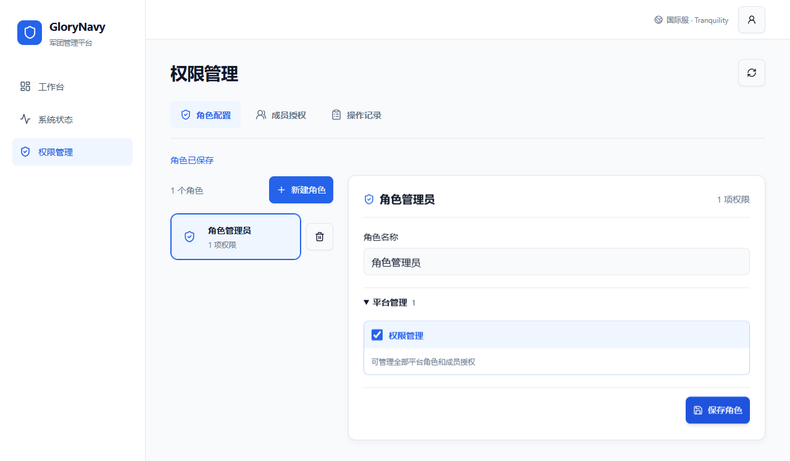
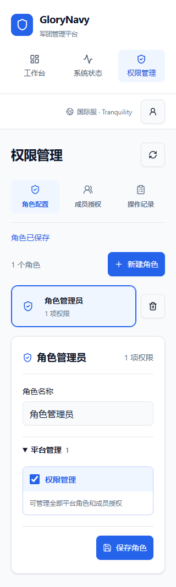
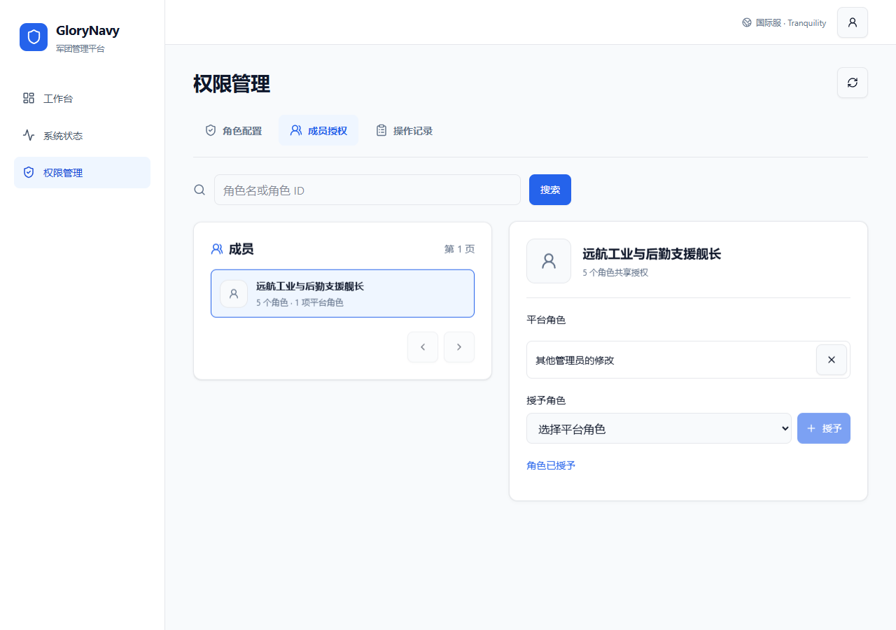

# 权限管理：页面需求与设计记录

2026-09-20：游戏职务改用官方 SDE 名称，包含人事主管、装配主管、母星燃料技术员与分部职务；折叠、权限判断和原始角色代码不变。[来源与维护](../integrations/eve-terminology.zh-CN.md)。

钱包模块交付后，权限目录开放军团流水、市场交易及钱包 1…7 分部；业务能力与对应分部需同时满足，资产分部仍不展示。

2026-09-16：操作确认复用公共 `ConfirmDialog`，统一外层样式与按钮；默认聚焦取消，提交中禁止关闭与重复提交，错误在原弹窗展示。权限校验及业务操作不变。

适用范围：`/access`。更新：2026-09-14。遵循[通用 UI 规范](../ui-design-rules.md)，本页参数不是全站限制。

## 目标与结构

- 提供角色配置、成员授权、操作记录三个分区。只向后端判定具备 `access.manage` 的用户展示导航；未登录转登录页，无权限直达显示拒绝。后端对每个请求独立鉴权、检查资料完整度及写请求 Origin/CSRF。
- 角色配置采用窄列表加详情编辑区，最大页面宽 1120px、角色侧栏 264px、间距 24px；不足 760px 内容宽度时纵排。角色名和权限数量为列表主信息，删除图标有中文名称及确认框。
- 当前仅显示平台管理中的“权限管理”。军团业务、钱包与资产分部整组隐藏，待对应功能完成后随功能开放。角色列表与编辑区的权限数量只统计当前公开目录；编辑时原样保留未公开的历史授权，不因界面隐藏而删除。
- 成员按任一绑定角色姓名、角色 ID 或账号 UUID 搜索，列表显示账号主角色、绑定数量与平台角色数量。选中后在详情授予或撤销角色；该授权属于整个本站账号。
- 操作记录按时间倒序，常态只显示操作和时间，展开显示操作者、对象 ID、记录 ID。保留已删除对象的稳定 ID，不虚构历史名称和变更前后内容。

## 样式与交互

沿用蓝、灰、白和轻阴影；图标使用 Lucide，卡片内边距 24px，窄屏 20px。辅助信息至少 12px，表单输入 16px、控件 44px，焦点使用蓝环。小屏导航图标与名称纵排，避免三项导航挤断中文。

保存失败保留输入并聚焦错误；字段错误靠近输入。版本冲突返回 409，明确点击“读取最新内容”后重置编辑。删除与撤销使用可键盘操作的确认对话框；切换分区清除上一任务的成功提示。刷新重新读取服务端数据，不强制刷新 ESI。

## 验证边界

桌面与手机浏览器测试覆盖未上线分区隐藏、历史授权保留、保存、成员授予/撤销、并发冲突恢复、删除确认、普通成员隐藏菜单及直接访问拒绝；截图检查 375px、320px、长成员名及多角色共享授权。演示截图不是实际成员权限记录。

权限目录只展示已经交付的功能，不提前展示或提供未开发业务的配置入口。底层 SeAT 映射与历史授权兼容独立维护。Squads 自动分组、权限来源解释器、完整审计差异和角色继承不在本期。

本次目录收紧已通过 access 隔离 PostgreSQL 测试、前端 lint/构建，以及 6 项桌面/手机浏览器测试，覆盖隐藏分区和历史授权保留。

## 本轮截图

以下为模拟 API 数据，截图中的权限名称和成员用于布局与操作验收，不是线上授权清单。

