# 全站卡片空间检查

日期：2026-09-14。状态：当前结果见“当前布局”；其余章节保留历史记录。

## 当前布局：我的角色重排

本轮先分清文档职责：通用规范记录可复用的分组、层级、密度、文案、响应式和验收原则；具体字段、列数、尺寸放入[页面需求与设计记录](account.md)。

角色选择项统一尺寸和内容起点，浅蓝选中态配勾选角标；身份栏采用轻量浅蓝背景，主角色星标与姓名组合。军团图标、名称和职务按组排列，ESI 与平台角色保留合并后的底部结构。社区卡保持窄栏、QQ/KOOK 纵排，细线分组。原“本站角色”改为“平台角色”，空值为“未分配角色”，不暗示所有权限均为空。

验证：前端 lint、TypeScript/Vite 构建、18 项桌面/手机登录、角色、授权和社区资料浏览器测试通过。截图检查五角色、长姓名、320/375px、编辑表单；另用隔离演示页面检查单角色、多职务及空平台角色。选择项等高、完整长名和无横向溢出由现有浏览器断言验证；保存、错误恢复、授权失效、主角色和解绑边界均保留。补正角色选择项原来引用的未定义悬停和焦点变量。

截图来自演示 API 数据，角色图片请求失败时使用现有回退图标；不表示完成真实 EVE 数据联调。本轮未进行整站屏幕阅读器、浏览器缩放或生产验收。

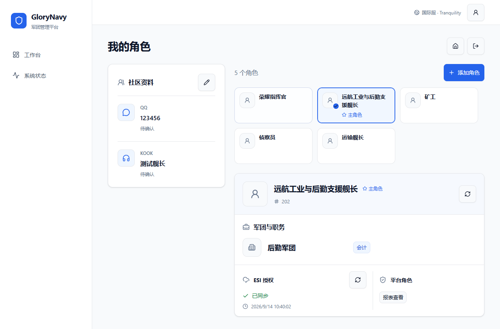

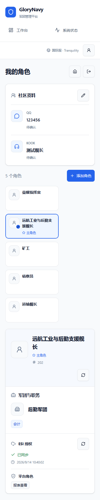

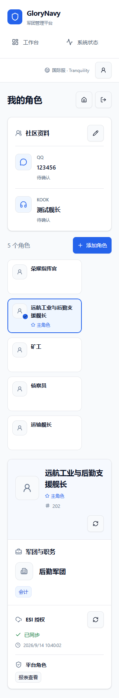

## 合并详情卡（本轮重排前）

ESI 授权与本站角色合并到详情卡底部，宽栏左右分区，520px 及以下上下排列；保留状态、时间、标签及刷新/恢复操作。使用细分隔线，不增加说明文字。下方较早截图保留为历史记录。

前端 lint、构建及 6 项桌面/手机角色和授权测试通过；检查 320px 长名字与底部信息区，未见横向溢出。截图为演示数据。

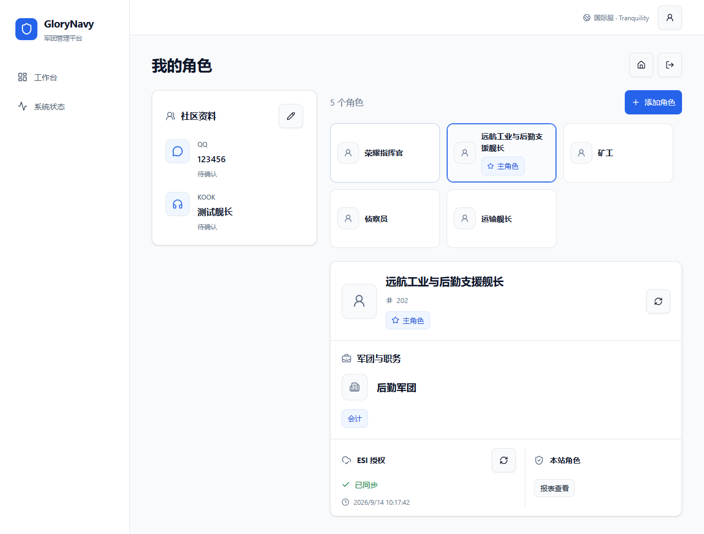

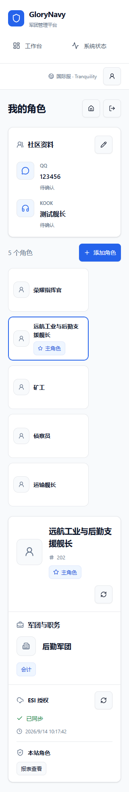

## 已实施修复（2026-09-14）

- 社区资料采用桌面 300px 窄栏，最大 360px；QQ/KOOK 在展示和编辑时均上下排列。角色内容独立在右栏，窄屏按原信息顺序纵排。
- 移除角色选择卡“本次登录”标记；会话归属与解绑保护不变，解绑当前登录角色时仍在确认框明确提示退出。
- 角色选择项现为按内容宽度排列、最大 220px 的弹性项，五角色自动换行；不再使用 auto-fill 加 1fr 的轨道。当前角色身份栏并入军团详情卡，加载与读取失败也保留身份栏，角色操作持续可用。
- 授权与本站角色保留独立卡片，改为在详情栏内并排/窄屏纵排；辅助信息组内间距 16px。没有合并游戏授权与本站权限。
- 工作台空状态去掉重复内边距；空状态与运行信息最大 640px。状态概览改为横向内容组合。
- 保留登录页、全局 Card 默认留白、字体可读性、44px 控件及自然卡片高度。加载区仍保留原来的垂直预留，没有为缩小图标周围空白而移除防跳动空间。

验证：前端 lint、TypeScript/Vite 构建及全套 26 项桌面/手机浏览器测试通过。新增断言检查社区卡宽度与上下行关系，以及无登录标记时解绑当前登录角色仍显示退出提示。检查 320/375px 长昵称布局，未发现横向溢出。角色截图均为演示数据。

下图为第一轮分栏修复截图；后续已进一步收紧角色选择项，并合并身份栏，当前规则见[角色页规范](account.md)。

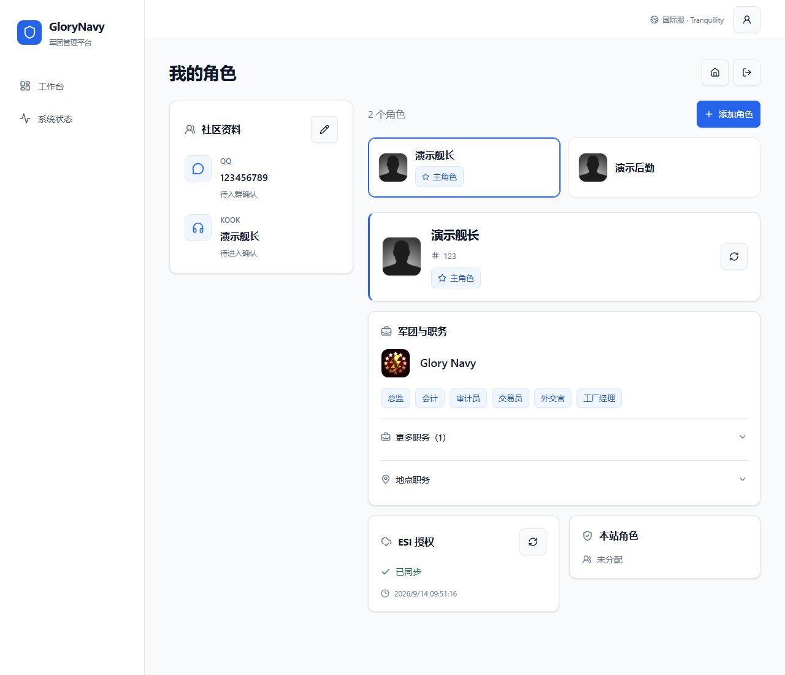

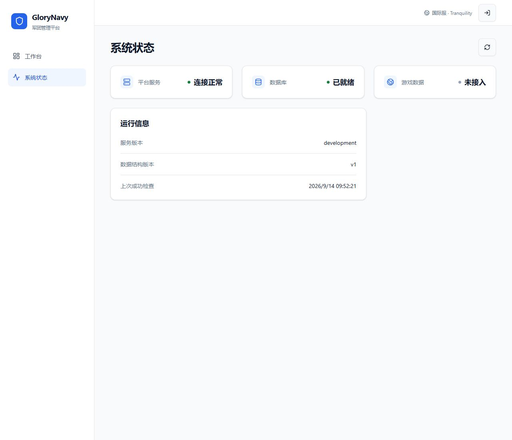

## 选择项尺寸统一（本轮重排前）

根据后续反馈，角色选择项已改为统一 200px 宽、所有行等高的网格；长名字自然换行，QQ/KOOK 状态精简为“待确认／已确认”。下图为当时的桌面与 320px 五角色截图。按内容宽度的更早方案已被等高需求替代。

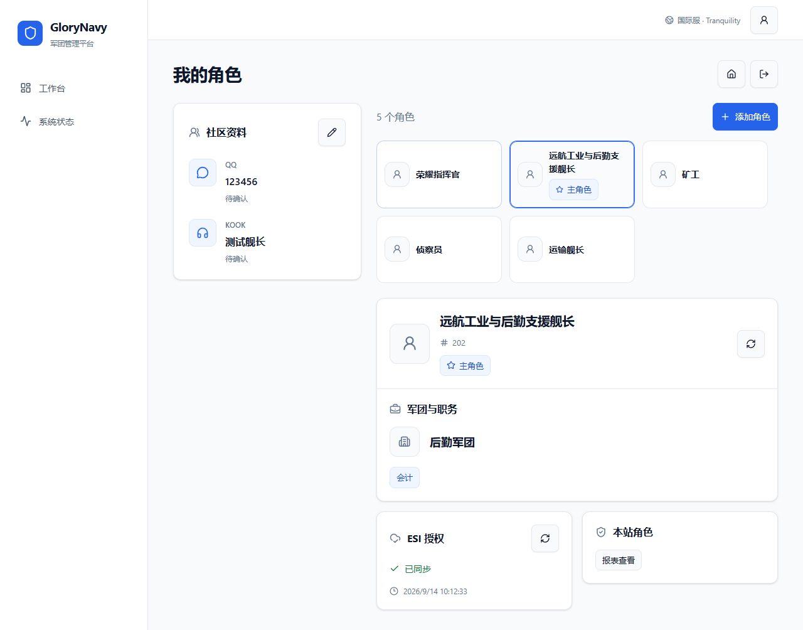

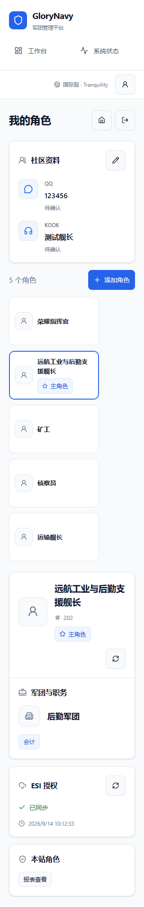

## 五角色列表与身份栏后续修复（历史）

选择项按内容宽度排列，最大 220px；主角色、长名字、选中状态均保留。身份栏与军团共用卡片，手机头像和名字并排、操作另行靠右。18 项相关浏览器测试通过；最后的手机身份栏调整另通过 4 项角色测试。以下为五角色演示截图。

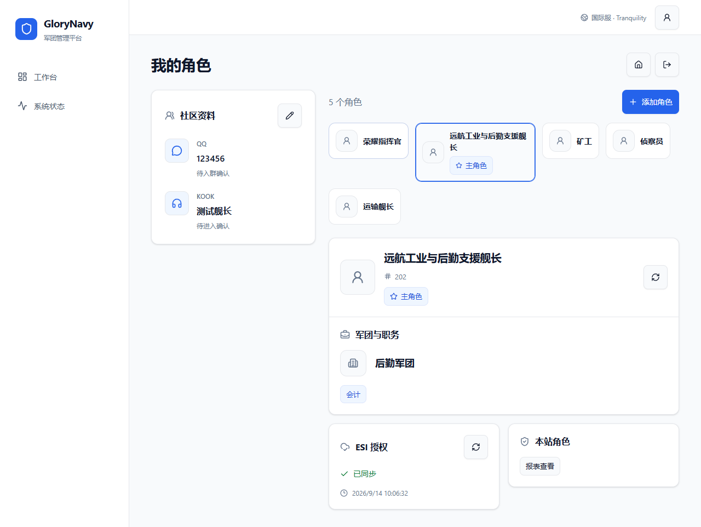

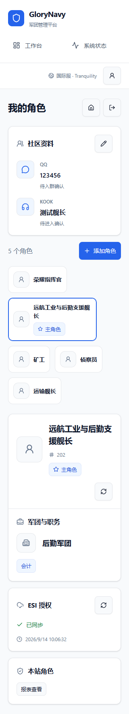

## 范围与依据

检查当前全部四个页面：工作台 `/`、系统状态 `/system`、角色 `/account`、登录 `/login`；覆盖通用 Card 的所有使用位置，以及角色选择卡。另检查社区表单、授权加载与读取失败的代表状态。

依据：[全局规范](../ui-design-rules.md)、[角色页规范](account.md)、[登录页规范](login.md)，以及本机 ui-ux-pro-max 的间距体系、内容分组、触控目标要求。Corporate Clean 的 24px 卡片内边距与 16/24px 元素间距，不等于卡片必须占满整行。

工作台、系统与登录为当前本地页面。浏览器未登录，因此角色相关截图使用同一套实际 React 组件和隔离演示数据，所有 API 请求在演示页面内处理，不读取或保存真实账号资料，不代表 ESI 实际联调。头像使用演示 ID，军团使用 Glory Navy 图片。

桌面视口宽 1280px，角色完整组合截图高 1200px，其余截图高 900px；手机检查 375px，表单补充 320px。下列尺寸为对应状态的 DOM 测量，取整后以 CSS px 表示；有滚动条时可用宽度略减。截图为检查现场，非设计稿。

## 卡片清单与结论

| 卡片 | 当前观察 | 建议 | 优先级 |
| --- | --- | --- | --- |
| 平台服务、数据库、游戏数据状态卡 | 桌面每张约 305×134，3 列；375px 已切成约 335×66 横行 | 手机保留；桌面短状态可使用图标、标签、结果横向组合，避免状态值单独撑高。保留可读字号 | 中 |
| 工作台无军团数据 | 约 964×233，只容纳图标、标题、入口；Card 与内容各加 24px 上下内边距，合计单侧 48px | 去掉重复一层留白，采用适量宽度的空状态区域；不要让短内容占满整行白色大面板 | 高 |
| 系统运行信息 | 约 964×230，三组短键值分居左右边缘，扫描距离过长 | 限制键值卡宽度（建议从 560–640px 试验），或与概览状态并排；不增加内容填空 | 高 |
| 社区资料（已填） | 约 964×186，只有 QQ/KOOK 两项；手机纵排约 270px 高 | 保留原信息层级，缩减外部分配宽度，放进账号级资料栏；不再把状态强行挤进标题或缩小图标 | 高 |
| 社区资料（编辑） | 两个输入框桌面宽度远大于常见值，保存按钮离输入起点较远 | 在资料栏内自然展开；根据栏宽变为单列，不固定卡片高度。保留字段标签、错误、44px 输入高度与 16px 输入字号 | 高 |
| 角色选择卡 | 两角色时每张约 476×98，auto-fit 加 1fr 导致少量卡片填满一行；单角色时列表实际不显示 | 使用有宽度上限的响应式卡片轨道（建议 240–320px 起），允许行尾留白；手机继续单列 | 高 |
| 当前角色资料 | 约 964×159，96px 头像、姓名、ID 和少量操作集中在两端 | 作为角色详情栏的标题卡，随详情栏宽度显示；保留头像辨识度与角色操作区域 | 高 |
| 军团与职务 | 约 556×374，包含军团图标、6 个标签、更多与地点职务折叠入口；本身按内容长高 | 保留较宽详情栏、24px 内边距和自动高度；已有 align-items:start，未被邻卡强行拉高 | 保留 |
| ESI 授权 | 约 384×181，标题、状态、时间三组内容均相隔 24px；错误时还需恢复入口 | 将状态与时间视为相关内容组，组内用较小间距；与本站角色可共用外层辅助卡，但必须保留两个明确分区 | 中 |
| 本站角色 | 未分配时约 384×119，仅标题与一行结果 | 与授权辅助区合理组合，或以短状态区呈现；仍需支持多角色标签换行，不能为省空间隐藏未分配状态 | 中 |
| 授权加载卡 | 约 964×170，仅一个等待图标；内层 min-height:120px 加外层上下内边距 | 最终布局确定后按目标卡片位置设置加载骨架或占位，避免用整行空卡代替所有加载形态；也不能盲目压小导致加载完成后明显跳动 | 中 |
| 读取失败卡 | 社区约 138px 高，授权约 94px 高；都是短原因与重试，当前横向仍占整行 | 保持错误与重试可见，继承对应业务卡片宽度；不单独把错误状态扩成整行 | 中 |
| 登录品牌卡 | 桌面 960px 宽，舰船画面最低 420px 高；手机为上图下操作 | 保留。空间用于品牌图像和唯一登录操作，符合已确认登录页适配，不套用后台资料卡密度 | 保留 |

## 检查时的建议（历史记录，以已实施修复为准）

1. 工作台与系统：概览状态保持统一网格；短键值与空状态按内容限制宽度，取消空状态的双重内边距。
2. 角色页：账号级社区资料与角色详情采用主次分栏。社区资料保持独立账号归属；角色列表、头像资料、军团职务在角色详情栏内排列。不要将社区资料视觉上归到某个小号下面。
3. 辅助卡：ESI 授权和本站角色按信息组组织；同一外层卡内也必须用两个标题和分隔明确区分游戏授权、本站权限。
4. 高度由内容决定，不设置统一固定高度或无意义的最小高度，不为了齐底拉伸低内容卡片。保留 24px 外层留白；真正的问题先通过宽度和分栏解决。
5. 手机仍采用单列，保留当前信息顺序和 44px 操作目标。布局变化后需重新检查长昵称、多个本站角色、授权失败以及 320/375px。

以上宽度是下一轮实现的起点，不是已验收参数。当前全局 Card 默认样式没有修改。

## 截图检查步骤

### 1. 工作台：空状态留白过多，手机状态横行合理

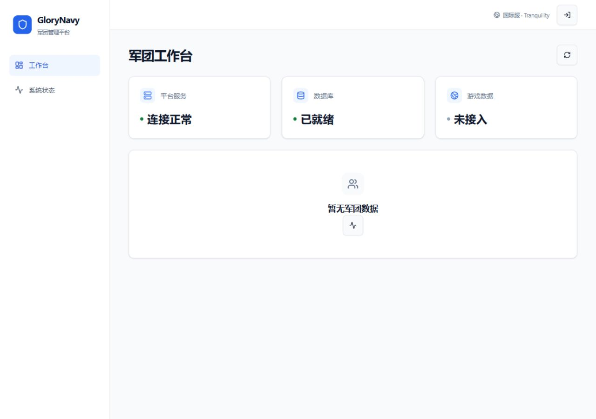

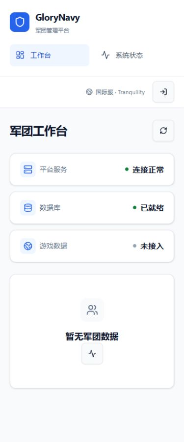

### 2. 系统状态：运行信息横向跨度过大

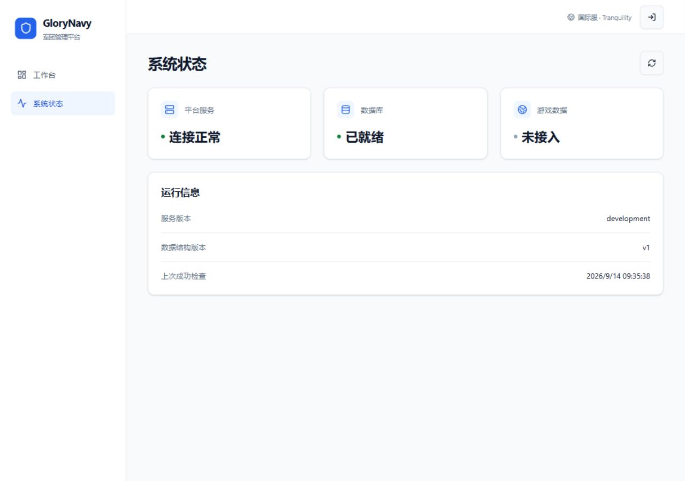

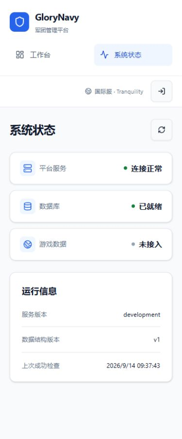

### 3. 角色页：短资料卡占整行；军团职务空间合理（演示数据）

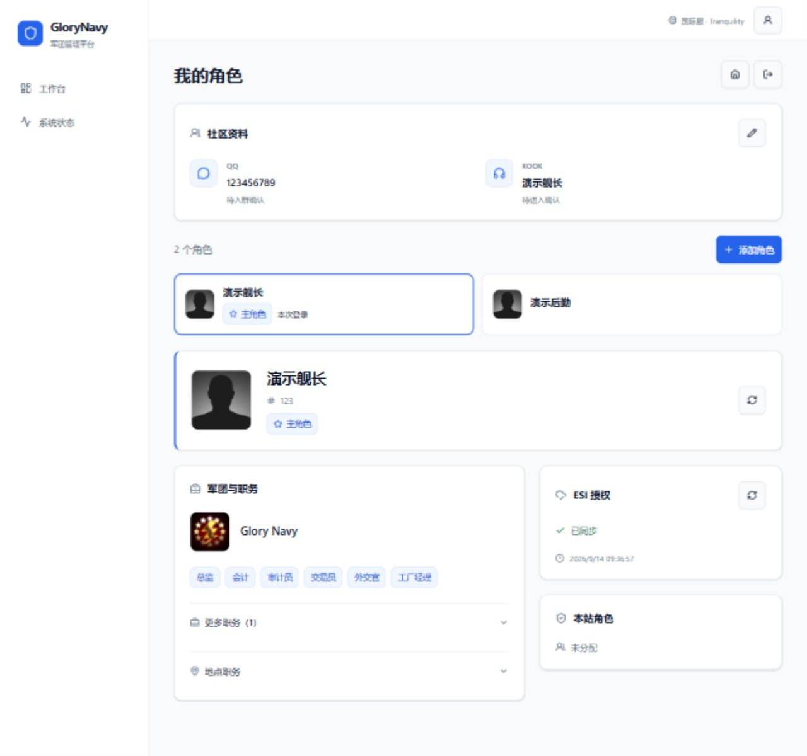

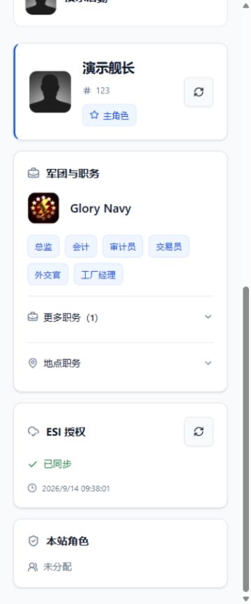

### 4. 登录页：品牌卡布局合理

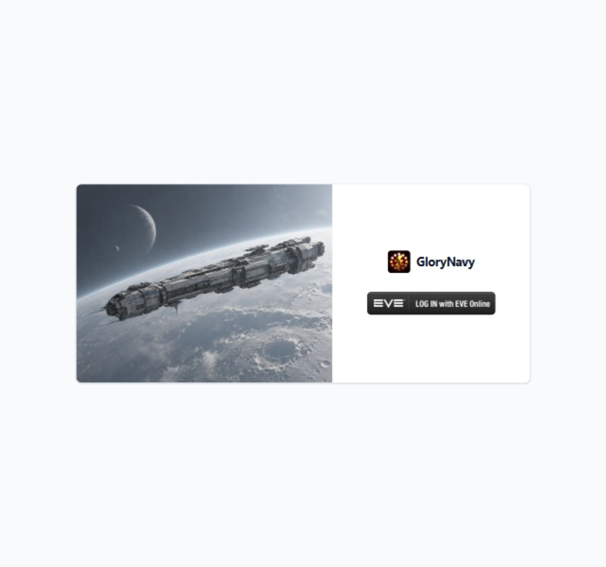

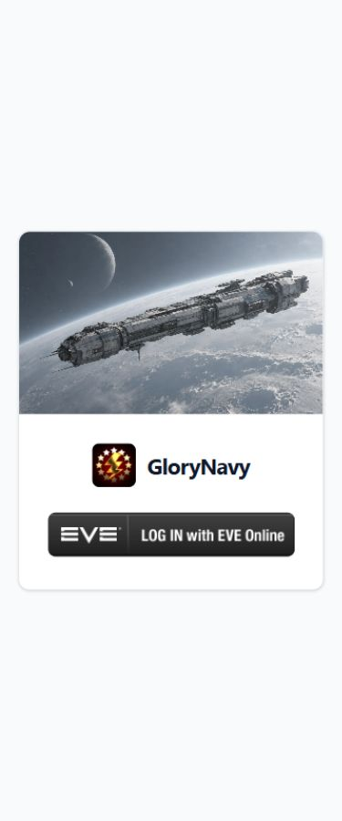

### 5. 表单：可读与可操作；宽度可随资料栏调整（演示数据）

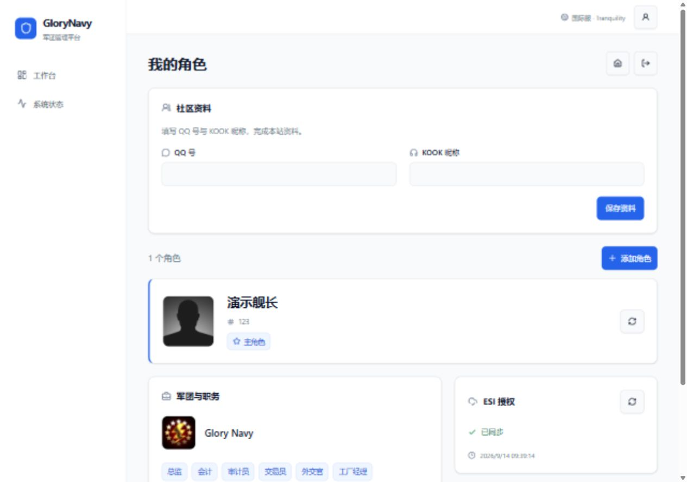

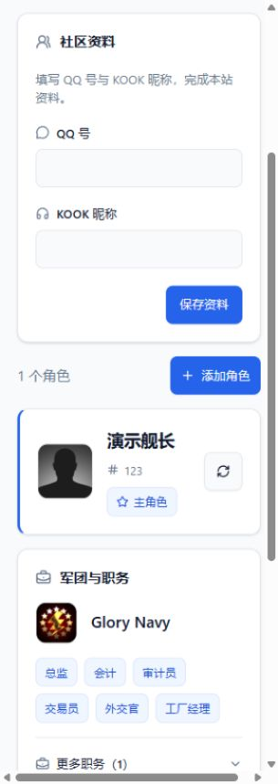

### 6. 失败状态：错误与重试清晰，建议继承业务卡宽度（演示数据）

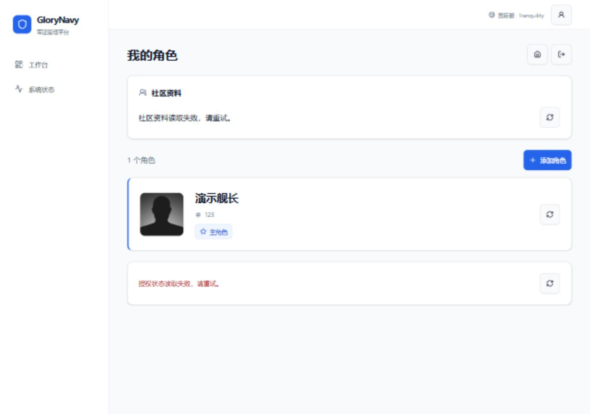

### 7. 加载状态：整行占位过宽，需配合目标布局调整（演示数据）

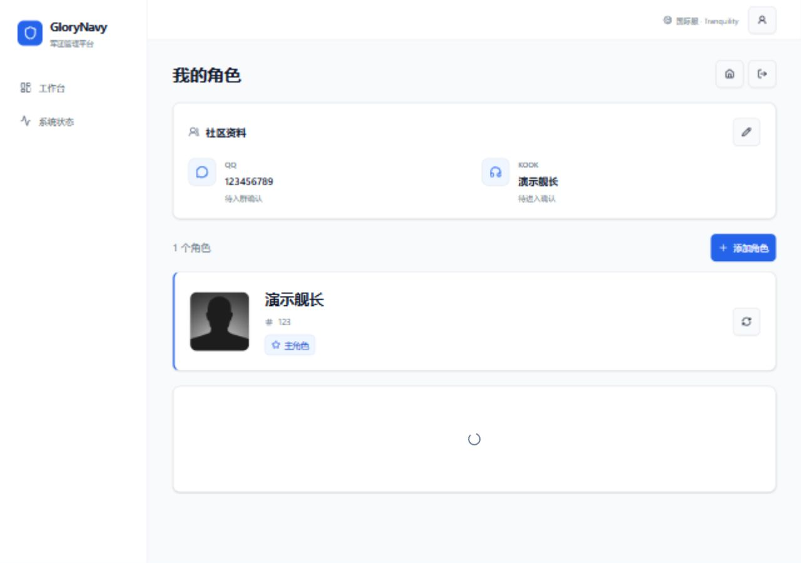

## 检查边界

以下边界描述原检查阶段；后续修复验证见文首。原检查没有改动业务页面。375px 系统与角色、320px 社区表单测量未见横向溢出；320px 表单输入与按钮高度为 44px，输入字号 16px。没有据此宣称全站全部状态通过可访问性认证。

未穷举所有网络异常、真实登录角色数据、200% 缩放与屏幕阅读器行为。身份读取失败、社区加载等共享结构另结合源码检查；不把没有单独截图的状态写成完成视觉验收。解绑确认框不是页面卡片，本轮仅核对其代码中的最大 440px 宽、24px 内边距与可滚动边界，没有触发真实解绑。

主要定位文件：

- [卡片组件](../../web/src/components/ui/card.tsx)
- [全站卡片布局样式](../../web/src/index.css)
- [工作台及系统页面](../../web/src/modules/system/workspace-page.tsx)
- [角色页面](../../web/src/modules/eve/account-page.tsx)
- [社区资料卡](../../web/src/modules/community/profile-card.tsx)
- [军团与授权卡](../../web/src/modules/access/authorization-summary.tsx)
